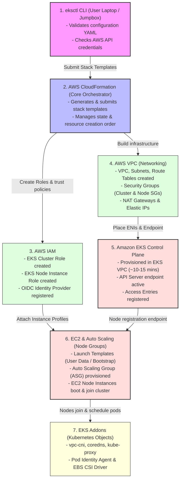

# Under the Hood: EKS Cluster Provisioning Flow with `eksctl`

This document details the step-by-step sequence of operations that occurs when you execute `eksctl create cluster`. It maps out the dependencies, orchestration mechanisms, and AWS services that `eksctl` interacts with to build your environment.

---

## Architectural Flow Diagram (Sequence of Creation)

The diagram below represents the sequential order of operations, starting from your jumpbox/local system down to AWS API orchestrations:

---

## Step-by-Step Provisioning Sequence

1.  **CLI Validation & Credentials Check (`eksctl`)**
    *   The `eksctl` tool validates the parameters in your `cluster.yaml` template.
    *   It calls AWS STS (`GetCallerIdentity`) to verify that the active CLI session has administrative permissions.

2.  **CloudFormation Stack Submission**
    *   Instead of calling individual AWS APIs directly, `eksctl` converts your configuration into CloudFormation templates and submits the parent stack (`eksctl-cluster`) to AWS.

3.  **AWS IAM Provisioning**
    *   CloudFormation creates the **EKS Control Plane Role** (allowing EKS to manage networks/load balancers).
    *   It creates the **EKS Node Instance Role** (allowing nodes to speak to EKS, ECR, and CloudWatch).
    *   It prepares trust policies to support OIDC token authentication.

4.  **VPC & Networking Build**
    *   Provisions the VPC, Subnets (public and private), Route Tables, Internet Gateways, and NAT Gateways.
    *   Creates the **EKS Cluster Security Group** and **Node Security Group** to lock down ports.

5.  **EKS Control Plane Provisioning**
    *   AWS spins up the managed Kubernetes control plane (API Server, Scheduler, `etcd`) in a hidden AWS-managed network.
    *   It places **Elastic Network Interfaces (ENIs)** into your subnets to bridge communication between the EKS Control Plane and your VPC.
    *   Registers the cluster API server endpoint URL and sets up the **Access Entry** mapping the creator to `cluster-admin`.
    *   Exposes the cluster's **OIDC Issuer URL**.

6.  **EC2 & Auto Scaling Group Launch (Worker Nodes)**
    *   `eksctl` triggers a CloudFormation substack to configure **EC2 Launch Templates** containing a base shell bootstrap script (`/etc/eks/bootstrap.sh`).
    *   It creates the **EC2 Auto Scaling Group (ASG)** which launches your EC2 instances.
    *   As the instances boot, they run the bootstrap script, contact the EKS API server endpoint, and register themselves as `Ready` nodes.

7.  **Core Kubernetes Addons Bootstrapping**
    *   `eksctl` deploys the core networking and management components directly onto the newly joined worker nodes:
        *   **`vpc-cni`**: Pulls secondary CIDR IPs (`100.64.x.x`) for the pods.
        *   **`coredns`**: Handles internal cluster DNS.
        *   **`kube-proxy`**: Manages service routing.
        *   **`eks-pod-identity-agent`**: Routes pod auth requests to AWS IAM.

---

## Phase-by-Phase Provisioning Details

### Phase 1: Local Configuration & Validation
When you run `eksctl create cluster -f cluster.yaml`:
*   `eksctl` validates your YAML config against its internal API schema.
*   It calls the AWS STS service (`sts:GetCallerIdentity`) to verify your active AWS session and permissions.
*   It checks if the requested EKS Kubernetes version is supported in the target region.

---

### Phase 2: AWS CloudFormation (The Orchestrator)
Instead of creating resources directly via isolated API calls (like Terraform does), `eksctl` uses **AWS CloudFormation** to manage state and rollbacks.
*   **Default Stack (`eksctl-<cluster-name>-cluster`)**: Provisions the VPC, subnets, base security groups, OIDC provider, IAM roles, and the EKS control plane.
*   **Substack (`eksctl-<cluster-name>-nodegroup-<ng-name>`)**: Provisions the EC2 Auto Scaling Group, Launch Templates, and worker node IAM roles. If you delete a cluster, CloudFormation cleanly deletes these resources in the exact reverse order.

---

### Phase 3: IAM Configuration (Security & Identity)
`eksctl` creates and configures the following AWS IAM resources:
1.  **EKS Cluster Service Role**: Allows the EKS control plane to interact with AWS APIs (e.g. creating network interfaces).
2.  **EKS Node Instance Role**: Attached to the worker nodes to authorize them to download images from Amazon ECR, register with the EKS API, and send logs to CloudWatch.
3.  **OIDC Identity Provider**: Registers the cluster's unique OIDC provider URL with AWS IAM, enabling **IAM Roles for Service Accounts (IRSA)** so pods can securely assume IAM Roles.

---

### Phase 4: VPC & Networking Construction
If you let `eksctl` create a VPC, it provisions:
*   **VPC & Subnets**: Typically 3 public subnets (routing through an Internet Gateway) and 3 private subnets (routing through NAT Gateways).
*   **Security Groups**:
    *   *Cluster Security Group*: Shared by the EKS control plane and nodes to allow complete internal traffic.
    *   *Node Security Group*: Restricts traffic entering the EC2 worker instances.
*   **Elastic IPs & NAT Gateways**: Configured for private subnet outbound internet access.

---

### Phase 5: EKS Control Plane Provisioning
EKS is a managed service, meaning AWS handles the control plane:
*   AWS provisions the Kubernetes Control Plane (API Server, Controller Manager, Scheduler, `etcd`) across multiple availability zones in a hidden, AWS-managed VPC.
*   EKS creates **Elastic Network Interfaces (ENIs)** in your subnet space to allow private, low-latency traffic between the EKS control plane and your worker nodes.
*   EKS generates the public/private API endpoint URL (e.g. `https://xxxxxx.gr7.us-east-2.eks.amazonaws.com`).
*   The executing IAM identity is added as an **EKS Access Entry** with `cluster-admin` permissions.

---

### Phase 6: EC2 & Auto Scaling (Worker Nodes)
Once the control plane endpoint is healthy, `eksctl` initiates node creation:
*   **EC2 Launch Templates**: Configures instance details (Disk Size, Key Pairs, Security Groups) and embeds EKS **User Data** (a bash bootstrap script: `/etc/eks/bootstrap.sh <cluster-name>`).
*   **EC2 Auto Scaling Groups (ASGs)**: Launches the requested number of instances in your subnets.
*   **Node Registration**: As the EC2 instances boot, they execute the bootstrap script, contact the EKS API endpoint, register themselves, and change status to `Ready` in Kubernetes.

---

### Phase 7: Core Kubernetes Addons Installation
To complete the setup, `eksctl` applies the core system pods directly onto the active worker nodes:
*   **`vpc-cni`**: Handles pod IP allocation directly from your AWS VPC subnet CIDRs.
*   **`coredns`**: Manages internal Kubernetes DNS resolution.
*   **`kube-proxy`**: Manages iptables/IPVS service routing rules on each node.
*   **`eks-pod-identity-agent`**: Bridges authentication requests between pods and AWS IAM.

---

## AWS Services Touched by `eksctl`

Here is a summary of the AWS resources and services created during the flow:

| AWS Service | Resources Created / Modified | Purpose |
| :--- | :--- | :--- |
| **CloudFormation** | `eksctl-cluster` and `eksctl-nodegroup` stacks | Orchestrates the state, dependencies, and rollbacks. |
| **EKS** | EKS Control Plane Cluster, Access Entries | Managed Kubernetes control plane. |
| **EC2** | EC2 Instances, Launch Templates, ENIs | Worker nodes and network interfaces. |
| **Auto Scaling** | Auto Scaling Groups (ASG) | Manages scaling, self-healing, and node capacity. |
| **VPC** | VPC, Subnets, Route Tables, Internet Gateways, NAT Gateways, Elastic IPs | Core networking and internet routing. |
| **IAM** | Roles, Instance Profiles, OIDC Identity Provider | Auth and credentials mapping (cluster, nodes, pods). |
| **ECR** | Pulls images from public/private ECR | Core system pods (`aws-node`, `coredns`). |
| **CloudWatch** | Log groups (if cluster logging is enabled) | Auditing and logging of EKS Control Plane components. |
| **STS** | Temporary security credentials | Fetches cluster token for `kubectl` authentication. |
