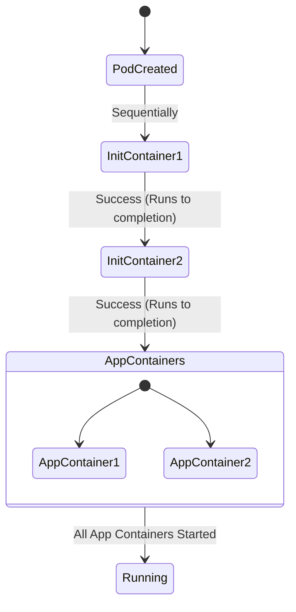

# Architectural Guide: Kubernetes Init Containers

This document explains the concept of **Init Containers** inside a Kubernetes Pod, how they differ from standard application containers, and outlines common production use cases with hands-on YAML examples.

---

## 📐 How Init Containers Work

Init containers are specialized containers that run **before** the app containers start. They are designed to perform initialization tasks, write configuration files, or wait for external dependencies.



### Key Differences from App Containers:
1.  **Execution Order**: Init containers run **sequentially** (one after another), whereas app containers run in **parallel**.
2.  **Lifecycle**: Init containers must run to **completion** (exit with code `0`) before the next container can start. App containers are expected to run indefinitely.
3.  **Liveness/Readiness Probes**: Init containers do not support `livenessProbe`, `readinessProbe`, or `startupProbe` because they must terminate before the pod is considered "Ready".
4.  **Resource Allocation**: The Pod's total resource request is calculated as the highest of:
    *   The sum of all app containers' resource requests.
    *   The highest resource request of any individual init container.

---

## 🛠️ Common Use Cases & Examples

---

### Use Case 1: Waiting for a Dependency (Database)
Applications often crash loop if their target database is not ready when they boot. An init container can block app container startup until the database is accepting TCP connections.

#### YAML Manifest (`init-wait-db.yaml`)
```yaml
apiVersion: v1
kind: Pod
metadata:
  name: frontend-app
  labels:
    app: frontend
spec:
  initContainers:
  - name: wait-for-db
    image: busybox:latest
    command: ['sh', '-c', 'until nc -z -v -w3 db-service 5432; do echo "Waiting for postgres..."; sleep 2; done']
  containers:
  - name: web-app
    image: nginx:latest
    ports:
    - containerPort: 80
```
*   **Behavior**: The `web-app` container will not start until the `wait-for-db` container successfully resolves and establishes a TCP connection on port 5432 to `db-service`.

---

### Use Case 2: Asset Pre-Loading via Shared Volume (`emptyDir`)
Init containers are excellent for downloading files, cloning Git repositories, or generating configuration files dynamically. They write data to a shared `emptyDir` volume that the main application mounts.

#### YAML Manifest (`init-asset-download.yaml`)
```yaml
apiVersion: v1
kind: Pod
metadata:
  name: static-web-server
spec:
  initContainers:
  - name: download-homepage
    image: alpine:latest
    command: ["sh", "-c", "wget -O /data/index.html https://raw.githubusercontent.com/kubernetes/kubernetes/master/README.md"]
    volumeMounts:
    - name: web-content
      mountPath: /data
  containers:
  - name: web-server
    image: nginx:alpine
    ports:
    - containerPort: 80
    volumeMounts:
    - name: web-content
      mountPath: /usr/share/nginx/html
  volumes:
  - name: web-content
    emptyDir: {}
```
*   **Behavior**: The init container downloads the target page into the `/data` directory of the shared `emptyDir` volume and exits. Nginx starts up and serves the downloaded file immediately.

---

### Use Case 3: Initializing File Permissions (Privilege Separation)
For security, production application containers should run as non-root users (e.g., UID `10001`). However, node volumes or network directories (like AWS EBS) often mount with `root` ownership, blocking the application container from writing files. 

An init container can run as `root` to `chown` the folder, allowing the secure app container to write files successfully.

#### YAML Manifest (`init-permissions.yaml`)
```yaml
apiVersion: v1
kind: Pod
metadata:
  name: secure-app
spec:
  securityContext:
    fsGroup: 2000 # Default filesystem group
  initContainers:
  - name: volume-permissions-fix
    image: busybox:latest
    command: ["sh", "-c", "chown -R 10001:10001 /data && chmod -R 770 /data"]
    securityContext:
      runAsUser: 0 # Runs as root to change file ownership
    volumeMounts:
    - name: data-volume
      mountPath: /data
  containers:
  - name: app
    image: alpine:latest
    command: ["sh", "-c", "echo 'Secure write!' > /data/out.txt && sleep 3600"]
    securityContext:
      runAsNonRoot: true
      runAsUser: 10001 # Non-root application user
    volumeMounts:
    - name: data-volume
      mountPath: /data
  volumes:
  - name: data-volume
    emptyDir: {}
```
*   **Behavior**: The root-privileged init container takes ownership of the directory, then exits. The secure app container launches under UID `10001` and is able to write to `/data/out.txt` without permission errors.

---

## 🚨 Troubleshooting Init Containers

If your pod hangs in `Init:0/1` or `Init:CrashLoopBackOff` state:

1.  **Inspect the Pod status**:
    ```bash
    kubectl get pods
    ```
2.  **Describe the Pod to check container events**:
    ```bash
    kubectl describe pod <pod-name>
    ```
    Look at the `Init Containers` section in the output to check exit codes.
3.  **Read the logs of the failed init container**:
    ```bash
    # You must append the -c flag to specify which container's logs to read
    kubectl logs <pod-name> -c <init-container-name>
    ```
