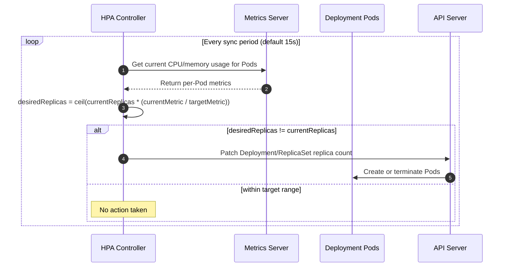

# Horizontal Pod Autoscaler (HPA) with CPU Metrics

This lab guide explains how the Kubernetes **Horizontal Pod Autoscaler (HPA)** automatically scales the number of Pod replicas up or down based on observed resource utilization. You will deploy a CPU-bound application, attach an HPA driven by CPU metrics, generate load to trigger scale-up, and watch it scale back down once load subsides.

---

## Prerequisites

- A working EKS/Kubernetes cluster with `kubectl` configured.
- The **Metrics Server** add-on installed and running (HPA reads live usage from it):
  ```bash
  kubectl get deployment metrics-server -n kube-system
  ```
  If missing, install it (see [eksctl/04-addons/install-metrics-server.sh](../../eksctl/04-addons/install-metrics-server.sh)).

---

## Overview

```
Step 1 → Deploy a CPU-Bound Application with Resource Requests
Step 2 → Create an HPA Targeting CPU Utilization
Step 3 → Generate Load and Observe Scale-Up
Step 4 → Stop the Load and Observe Scale-Down
Step 5 → Validate the Full Scaling Timeline
Step 6 → Clean Up
```

---

## Step 1 — Deploy a CPU-Bound Application with Resource Requests

HPA needs a **CPU request** defined on the container — utilization percentage is always calculated relative to the request, not the node's total capacity.

```bash
kubectl create namespace hpa-demo
```

`php-apache.yaml`:

```yaml
apiVersion: apps/v1
kind: Deployment
metadata:
  name: php-apache
  namespace: hpa-demo
spec:
  replicas: 1
  selector:
    matchLabels:
      run: php-apache
  template:
    metadata:
      labels:
        run: php-apache
    spec:
      containers:
      - name: php-apache
        image: registry.k8s.io/hpa-example
        ports:
        - containerPort: 80
        resources:
          requests:
            cpu: 200m
          limits:
            cpu: 500m
---
apiVersion: v1
kind: Service
metadata:
  name: php-apache
  namespace: hpa-demo
spec:
  selector:
    run: php-apache
  ports:
  - port: 80
```

```bash
kubectl apply -f php-apache.yaml
kubectl wait --for=condition=Available deployment/php-apache -n hpa-demo --timeout=60s
```

> **Key Learning**: The `hpa-example` image serves a page that burns CPU on every request — perfect for demonstrating load-based scaling. The `requests.cpu: 200m` is the baseline HPA uses to compute utilization percentage.

---

## Step 2 — Create an HPA Targeting CPU Utilization

```bash
kubectl autoscale deployment php-apache -n hpa-demo \
  --cpu-percent=50 \
  --min=1 \
  --max=5
```

This is equivalent to applying the following manifest (`hpa-cpu.yaml`), which you can use instead if you prefer the declarative form:

```yaml
apiVersion: autoscaling/v2
kind: HorizontalPodAutoscaler
metadata:
  name: php-apache
  namespace: hpa-demo
spec:
  scaleTargetRef:
    apiVersion: apps/v1
    kind: Deployment
    name: php-apache
  minReplicas: 1
  maxReplicas: 5
  metrics:
  - type: Resource
    resource:
      name: cpu
      target:
        type: Utilization
        averageUtilization: 50
```

Verify the HPA object:

```bash
kubectl get hpa php-apache -n hpa-demo
```

Expected output (target shows `<unknown>` briefly until Metrics Server reports the first data point):

```
NAME         REFERENCE               TARGETS   MINPODS   MAXPODS   REPLICAS   AGE
php-apache   Deployment/php-apache   0%/50%    1         5         1          15s
```

> **Key Learning**: `averageUtilization: 50` means the HPA tries to keep average CPU usage across all Pods at **50% of the 200m request** (i.e., ~100m per Pod). If usage rises above that, it scales out; if it drops well below, it scales in.

---

## Step 3 — Generate Load and Observe Scale-Up

Open a **second terminal** and start a load generator that continuously hits the service:

```bash
kubectl run load-generator -n hpa-demo --image=busybox:1.36 --restart=Never -- \
  /bin/sh -c "while true; do wget -q -O- http://php-apache.hpa-demo.svc.cluster.local; done"
```

Back in your **first terminal**, watch the HPA react in real time:

```bash
kubectl get hpa php-apache -n hpa-demo --watch
```

Expected progression over the next 1-3 minutes:

```
NAME         REFERENCE               TARGETS     MINPODS   MAXPODS   REPLICAS   AGE
php-apache   Deployment/php-apache   0%/50%      1         5         1          1m
php-apache   Deployment/php-apache   250%/50%    1         5         1          2m
php-apache   Deployment/php-apache   250%/50%    1         5         4          2m30s
php-apache   Deployment/php-apache   105%/50%    1         5         5          3m
```

Confirm new Pods were actually created:

```bash
kubectl get pods -n hpa-demo -l run=php-apache
```

> **Key Learning**: The HPA scaled from 1 → 5 Pods (its configured `maxReplicas`) because sustained CPU usage was far above the 50% target. It did not exceed `maxReplicas` even though demand was higher — this is a safety ceiling you must size deliberately.

---

## Step 4 — Stop the Load and Observe Scale-Down

Stop the load generator:

```bash
kubectl delete pod load-generator -n hpa-demo
```

Keep watching the HPA:

```bash
kubectl get hpa php-apache -n hpa-demo --watch
```

Expected progression — notice scale-down takes noticeably longer than scale-up:

```
NAME         REFERENCE               TARGETS   MINPODS   MAXPODS   REPLICAS   AGE
php-apache   Deployment/php-apache   0%/50%    1         5         5          6m
php-apache   Deployment/php-apache   0%/50%    1         5         1          11m
```

> **Key Learning**: By default, the HPA waits a **stabilization window of 300 seconds (5 minutes)** with no scale-down actions after the last scale-up, to avoid flapping. Scale-up has almost no default stabilization delay, so it reacts fast; scale-down is intentionally conservative.

---

## Step 5 — Validate the Full Scaling Timeline

Inspect the HPA's decision history and events:

```bash
kubectl describe hpa php-apache -n hpa-demo
```

Look for the `Events` section at the bottom — you should see entries like:

```
Normal  SuccessfulRescale  New size: 4; reason: cpu resource utilization (percentage of request) above target
Normal  SuccessfulRescale  New size: 5; reason: cpu resource utilization (percentage of request) above target
Normal  SuccessfulRescale  New size: 1; reason: All metrics below target
```

### Validation Checklist

- [ ] `kubectl get hpa` showed `TARGETS` climb well above `50%` under load (Step 3)
- [ ] Replica count scaled up to `maxReplicas` (5) while load was sustained (Step 3)
- [ ] Replica count scaled back down to `minReplicas` (1) after load stopped (Step 4)
- [ ] `kubectl describe hpa` showed `SuccessfulRescale` events explaining each decision (Step 5)

---

## Step 6 — Clean Up

```bash
kubectl delete namespace hpa-demo
```

---

## Additional Example A — Scaling on Memory Utilization

CPU isn't the only metric HPA can react to. Memory-bound workloads (e.g., caches, JVM apps) can scale on memory utilization the same way, as long as `requests.memory` is set.

`php-apache-memory-hpa.yaml`:

```yaml
apiVersion: autoscaling/v2
kind: HorizontalPodAutoscaler
metadata:
  name: php-apache-memory
  namespace: hpa-demo
spec:
  scaleTargetRef:
    apiVersion: apps/v1
    kind: Deployment
    name: php-apache
  minReplicas: 1
  maxReplicas: 5
  metrics:
  - type: Resource
    resource:
      name: memory
      target:
        type: Utilization
        averageUtilization: 70
```

```bash
kubectl apply -f php-apache-memory-hpa.yaml
kubectl get hpa php-apache-memory -n hpa-demo
```

You can also combine **both** CPU and memory metrics on a single HPA — it scales based on whichever metric requires the *largest* number of replicas:

```yaml
apiVersion: autoscaling/v2
kind: HorizontalPodAutoscaler
metadata:
  name: php-apache-multi-metric
  namespace: hpa-demo
spec:
  scaleTargetRef:
    apiVersion: apps/v1
    kind: Deployment
    name: php-apache
  minReplicas: 1
  maxReplicas: 5
  metrics:
  - type: Resource
    resource:
      name: cpu
      target:
        type: Utilization
        averageUtilization: 50
  - type: Resource
    resource:
      name: memory
      target:
        type: Utilization
        averageUtilization: 70
```

> **Key Learning**: With multiple metrics, HPA computes a desired replica count independently for each metric, then picks the **highest** one — ensuring neither CPU nor memory pressure is left unaddressed.

---

## Additional Example B — Tuning Scale-Up / Scale-Down Behavior

The `behavior` field gives fine-grained control over how aggressively the HPA scales in each direction — useful for making scale-up faster (handle traffic spikes) or scale-down slower/gentler (avoid flapping).

`php-apache-behavior-hpa.yaml`:

```yaml
apiVersion: autoscaling/v2
kind: HorizontalPodAutoscaler
metadata:
  name: php-apache-tuned
  namespace: hpa-demo
spec:
  scaleTargetRef:
    apiVersion: apps/v1
    kind: Deployment
    name: php-apache
  minReplicas: 1
  maxReplicas: 10
  metrics:
  - type: Resource
    resource:
      name: cpu
      target:
        type: Utilization
        averageUtilization: 50
  behavior:
    scaleUp:
      stabilizationWindowSeconds: 0        # react immediately to spikes
      policies:
      - type: Percent
        value: 100                         # can double replica count
        periodSeconds: 15
      - type: Pods
        value: 4                           # or add up to 4 pods
        periodSeconds: 15
      selectPolicy: Max                    # use whichever policy scales more
    scaleDown:
      stabilizationWindowSeconds: 300       # wait 5 min before scaling down
      policies:
      - type: Percent
        value: 25                          # remove at most 25% of pods
        periodSeconds: 60
      selectPolicy: Min                     # use whichever policy scales less (safer)
```

```bash
kubectl apply -f php-apache-behavior-hpa.yaml
kubectl describe hpa php-apache-tuned -n hpa-demo
```

Re-run the load test from Step 3 against this HPA and compare timings:

| Behavior | Default HPA | Tuned HPA above |
|---|---|---|
| Time to first scale-up reaction | Up to ~15-30s (one metrics sync cycle) | Immediate (`stabilizationWindowSeconds: 0`) |
| Max replicas added per cycle | Unbounded by policy (governed only by algorithm + `maxReplicas`) | Capped at doubling or +4 pods per 15s, whichever is larger |
| Wait before scaling down | 300s (5 min) stabilization | Same, but removals capped at 25% of pods per 60s |

> **Key Learning**: `stabilizationWindowSeconds: 0` on scale-up makes the HPA aggressive for traffic spikes, while a longer scale-down window with a `Percent`/`Pods` cap prevents it from removing too many Pods at once if a metric dips only briefly — avoiding "flapping" between scale-up and scale-down.

---

## Key Takeaways

1. HPA requires **resource requests** (`cpu`/`memory`) on the target container — utilization is always a percentage of the request.
2. The **Metrics Server** is a hard prerequisite for `Resource` metric types (CPU/memory); without it, HPA can't read live usage.
3. Scale-up is fast by default; scale-down is deliberately slow (5-minute stabilization window) to prevent flapping.
4. Multiple metrics can be combined on one HPA — the controller always scales to satisfy the **most demanding** metric.
5. The `behavior` field lets you tune scale-up/scale-down aggressiveness independently, which is essential for production workloads with spiky traffic.

---

## How HPA Works


