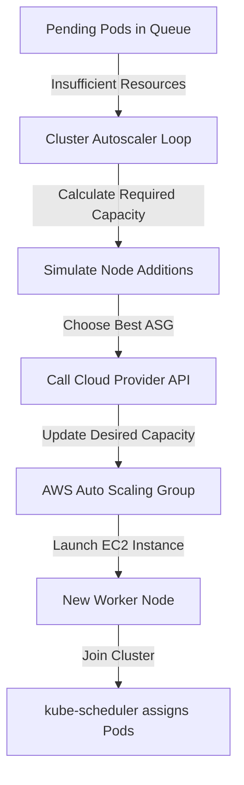
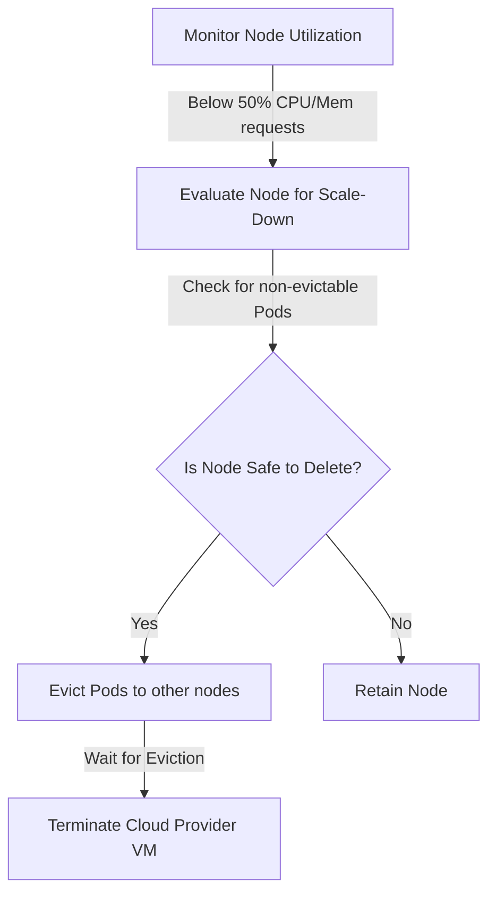
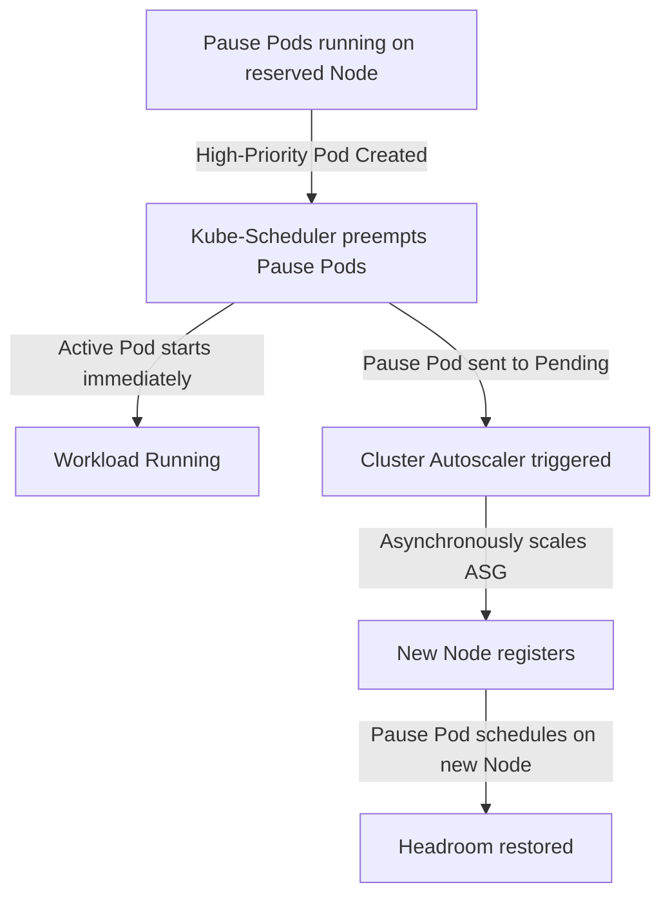

# How Kubernetes Cluster Autoscaler Works (Step-by-Step)

The **Cluster Autoscaler (CA)** is a standalone controller that dynamically adjusts the size of a Kubernetes cluster by scaling cloud provider node groups (e.g., AWS Auto Scaling Groups or EKS Managed Node Groups) based on resource demands.

---

## High-Level Architecture

Unlike traditional infrastructure autoscalers that monitor CPU/Memory utilization of virtual machines, Cluster Autoscaler is **request-driven**. It watches for **pods that cannot be scheduled** because of insufficient resources on existing worker nodes.

---

## Step-by-Step Scaling Workflow

Cluster Autoscaler runs as a control loop (typically checking every 10 seconds) and performs the following actions:

### 1. Detect Unschedulable Pods
* **Trigger**: The Kubernetes scheduler (`kube-scheduler`) fails to place a pod on any active worker node and marks the pod status as `Pending` with a scheduling failure reason (e.g., `0/3 nodes are available: 3 Insufficient cpu.`).
* **CA Action**: Cluster Autoscaler scans the cluster for these `Pending` pods. It filters out pods that are unschedulable for non-resource reasons (such as incorrect node affinity selectors or missing tolerations that cannot be resolved by adding new nodes).

### 2. Simulate Node Addition
* For the remaining resource-starved pods, CA simulates what would happen if a new node from one of the active Node Groups / ASGs was added to the cluster.
* It uses mock node templates representing the specifications of each Node Group to determine if the pending pods would fit.

### 3. Select the Node Group (Expander Strategy)
If multiple Auto Scaling Groups (ASGs) can satisfy the pending pods, CA decides which one to scale using an **Expander**:
* **Random** (default): Selects an ASG at random.
* **Most-pods**: Chooses the ASG that can schedule the highest number of pending pods.
* **Least-waste**: Selects the ASG that leaves the least idle CPU/Memory after scheduling the pods.
* **Price**: Selects the cheapest ASG (works with specific cloud providers).
* **Priority**: Follows a user-defined priority list (e.g., prefer Spot ASG over On-Demand ASG).

### 4. Scale Up the ASG
* Once the ASG is selected, CA makes an API call to the cloud provider (e.g., AWS EC2 Auto Scaling API: `SetDesiredCapacity`) to increase the number of requested instances in the target group by the calculated amount.

### 5. Instance Bootstrapping
* AWS launches a new EC2 instance.
* The instance executes its user-data bootstrap script, starting `kubelet` and container runtimes.
* The node registers itself with the Kubernetes API server and transitions to `Ready`.

### 6. Pod Scheduling
* `kube-scheduler` detects the new `Ready` node.
* It assigns the pending pods to the new node.
* Container images are pulled, and the pods transition to `Running`.

---

## Step-by-Step Scale-Down Workflow

To optimize costs, Cluster Autoscaler continuously checks if any nodes are underutilized:

1. **Identify Underutilized Nodes**:
   CA calculates the sum of resource **requests** (not actual usage) for all pods running on each node. If the sum is below a set threshold (typically 50% of the node's total capacity) for a sustained period (usually 10 minutes), the node is considered underutilized.
2. **Eviction Simulation**:
   CA simulates moving all pods from the underutilized node to other existing nodes. If the pods cannot fit anywhere else, the node is kept.
3. **Check Eviction Blockers**:
   A node **cannot** be scaled down if it runs:
   * Pods without a controller (bare pods not managed by a Deployment, ReplicaSet, DaemonSet, or StatefulSet).
   * Pods with local storage (e.g., `emptyDir`), unless they have the `"cluster-autoscaler.kubernetes.io/safe-to-evict": "true"` annotation.
   * System pods (like `kube-dns`) that do not have a Pod Disruption Budget (PDB) allowing their eviction.
   * Pods that would violate a Pod Disruption Budget if evicted.
4. **Evict & Terminate**:
   * If the node is safe to delete, CA taints it to prevent new pods from scheduling on it.
   * CA evicts the pods, forcing them to reschedule on other nodes.
   * CA updates the ASG's desired capacity down and terminates the target EC2 instance.

---

## Production Optimization: Overprovisioning with "Pause Pods"

Because Cluster Autoscaler is reactive (waiting for pods to fail scheduling before launching new EC2 instances), workloads experience a **2 to 5 minute scaling latency**. In production, this latency can be mitigated using **Overprovisioning (Pause Pods)**:

1. **How it works**:
   * You deploy low-priority "dummy" pods (often running the `registry.k8s.io/pause` image, which consumes resources but does nothing).
   * These pods are configured with a negative or very low priority using Kubernetes `PriorityClass`.
2. **Preemption**:
   * When a real application pod (with standard/high priority) is created and the cluster is full, the `kube-scheduler` immediately evicts ("preempts") the low-priority pause pods to free up space.
   * The application pod schedules onto the vacated capacity **instantly** (0 seconds launch time).
3. **Asynchronous Scaling**:
   * The evicted pause pods are pushed back into the `Pending` queue.
   * Cluster Autoscaler detects these pending pause pods and scales up a node in the background. Once the new node joins, the pause pods occupy it, restoring the cluster's headroom.

---

## Key Tuning Configuration Flags

You can customize Cluster Autoscaler behavior using Helm values or deployment flags:

* `--scan-interval` (Default: `10s`): How often the cluster is evaluated for scale-up. Lowering this increases API traffic but speeds up response times.
* `--scale-down-unneeded-time` (Default: `10m`): How long a node must remain underutilized before it is eligible for deletion.
* `--scale-down-utilization-threshold` (Default: `0.5`): The capacity threshold (e.g. 50% CPU/Mem requests) below which a node is considered for termination.
* `--expander` (Default: `random`): Strategy to select which ASG to scale up (`random`, `most-pods`, `least-waste`, `price`, `priority`).

---

## Strengths and Limitations

### Strengths
* **Mature & Battle-Tested**: Standard Kubernetes autoscaling tool since the early days of Kubernetes.
* **Declarative Integration**: Works seamlessly with EKS Managed Node Groups and standard cloud autoscaling structures.
* **Overprovisioning Control**: Supports fine-grained scheduling headroom via pod priority classes.

### Limitations
* **Slower Scale-Up (2–5 Minutes)**: Bounded by cloud provider ASG launch cycles and API speeds.
* **ASG Rigidity**: Limited to homogeneous instance groups. Cannot dynamically right-size instances for a specific workload size on the fly.
* **Inefficient Bin-Packing**: Because it is ASG-bound, it often leaves fragmented resources across multiple node groups.

