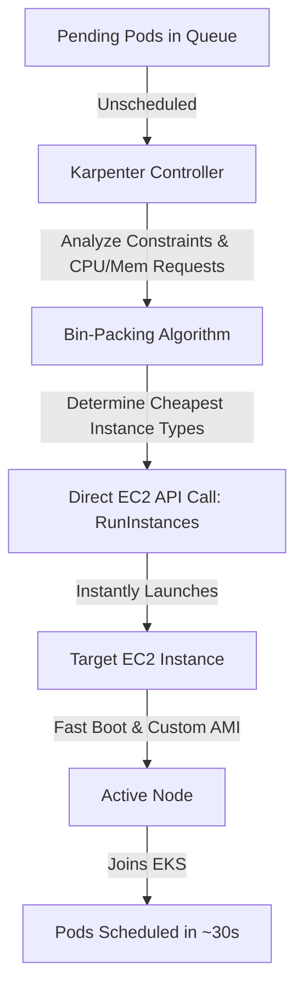
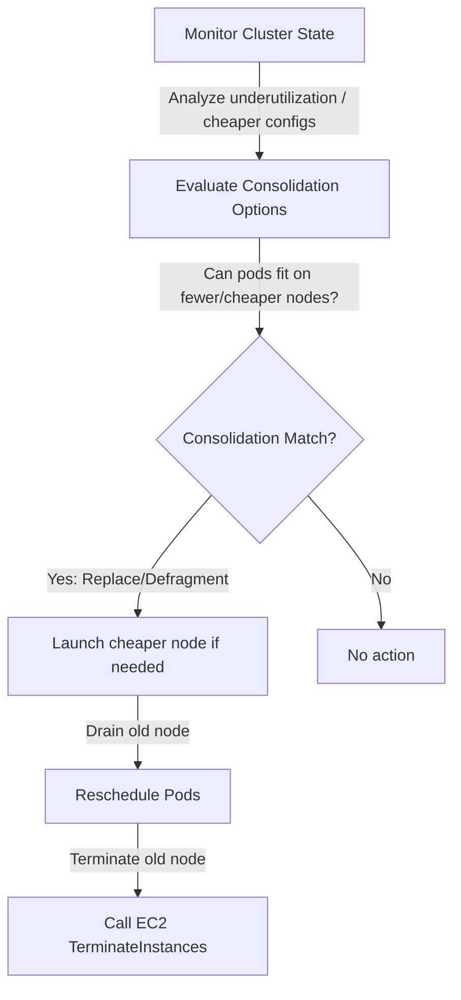

# How AWS Karpenter Works (Step-by-Step)

**Karpenter** is a high-performance, open-source node provisioning engine designed for Kubernetes. Unlike the legacy Cluster Autoscaler (which scales Auto Scaling Groups), Karpenter is **group-less**—it bypasses ASGs and calls AWS EC2 APIs directly to spin up optimal instances just-in-time.

---

## High-Level Architecture

Karpenter operates directly on Kubernetes pod specifications. It acts as an alternate scheduler assistant, evaluating resource requests and launching custom-sized nodes matching the specific workloads.

---

## Step-by-Step Scaling Workflow

Karpenter runs a control loop that monitors unschedulable pods and provisions compute capacity dynamically:

### 1. Watch the Scheduling Queue
* **Trigger**: A pod is created but cannot be scheduled by `kube-scheduler` due to lack of resources. The pod transitions to `Pending` status.
* **Karpenter Action**: Karpenter reads the pending pods' requirements directly from the API server.

### 2. Constraints and Requirement Evaluation
Karpenter evaluates the pod specifications to determine scheduling constraints:
* **Resource Requests**: CPU, Memory, GPU, and local storage requirements.
* **Node Selectors & Affinities**: Specific operating systems (Linux/Windows), architectures (amd64/arm64), or custom labels.
* **Tolerations**: If a pod tolerates specific taints (e.g., spot-only, GPU nodes).
* **Topology Spread Constraints**: Spreading pods across Availability Zones for high availability.

### 3. Right-Sizing & Bin-Packing
* Instead of picking a pre-defined node size (like an ASG would), Karpenter's **bin-packing algorithm** simulates placing the pending pods onto virtual node options.
* It evaluates hundreds of available EC2 instance types (e.g., `t3.medium`, `c6i.large`, `r6i.2xlarge`) in the target region.
* It calculates the most cost-effective instance type or combination of instances that can run the pending pods while satisfying all constraints.

### 4. Direct Cloud Provider API Launch
* Karpenter calls the AWS EC2 API (`ec2:RunInstances`) directly.
* It specifies the exact instance type, subnet (Availability Zone), security group, and billing capacity (Spot or On-Demand) based on the `EC2NodeClass` and `NodePool` CRD settings.
* It attaches a pre-configured **EC2 Instance Profile** with the Karpenter node role.

### 5. Fast Node Bootstrapping
* Since Karpenter bypasses the ASG scaling logic and launch templates, the instance launches immediately.
* It boots using an optimized AMI (such as Amazon Linux 2023 or Bottlerocket).
* The node registers itself directly with the EKS cluster using an automated bootstrap script.
* **Result**: The new node joins the cluster and is ready to accept pods in under **30 seconds** (compared to 2–5 minutes for ASGs).

### 6. Pod Scheduling
* Karpenter binds the pending pods to the newly joined node, allowing the containers to start immediately.

---

## Step-by-Step Disruption & Consolidation Workflow

Karpenter is designed to be highly proactive about scaling down and consolidating workloads to minimize AWS spend. This is governed by its **disruption** policies:

1. **Continuous Analysis**:
   Karpenter continuously monitors all active nodes in the cluster. It checks if workloads can be rearranged to use fewer nodes or cheaper instance sizes.
2. **Consolidation Actions**:
   * **Empty Nodes**: If a node becomes completely empty (no pods running except DaemonSets), Karpenter immediately deletes it by calling `ec2:TerminateInstances`.
   * **Underutilized Nodes**: If a node is underutilized, Karpenter simulates migrating the pods to other existing nodes in the cluster. If they fit, it drains the underutilized node and terminates it.
   * **Multi-Node Consolidation (Defragmentation)**: If multiple nodes are partially filled, Karpenter calculates if the workloads can be combined onto a single new, smaller, or cheaper node. It will provision the new node, reschedule the pods, and terminate the old nodes.
3. **Expiration**:
   Nodes have an expiration age (configured via `expireAfter` in the NodePool, e.g., 720 hours). Once a node reaches this age, Karpenter gracefully drains and terminates it, replacing it with a fresh node. This helps prevent configuration drift and ensures OS/kernel updates are regularly applied.
4. **Interruption Handling**:
   Karpenter monitors AWS SQS queues for EC2 Spot Interruption Warnings, Rebalance Recommendations, Scheduled Maintenance, or Instance Terminations. If an interruption warning is received, Karpenter immediately triggers a cordoning and draining workflow to replace the node *before* AWS reclaims it (typically within the 2-minute warning window).

---

## Under the Hood: Karpenter Node Bootstrapping Mechanics

When Karpenter provisions an EC2 instance, it configures it to join the EKS cluster without relying on an Auto Scaling Group launch template.

1. **Auto-Generated User Data**:
   * Karpenter queries your EKS cluster settings (APIServer endpoint, Cluster Certificate Authority, CIDR blocks) from the AWS API.
   * It dynamically generates the shell script (`UserData`) to configure the instance.
   * For the **Amazon Linux 2023** AMI family, Karpenter outputs the new standard node bootstrap configuration (`nodeadm` configuration schema) which configures the `kubelet` and registers the node.
2. **Custom User Data Integration**:
   * You can inject custom scripts (e.g., custom security agent installations, proxy configurations) via the `spec.userData` field in the `EC2NodeClass`. Karpenter merges your custom script with the auto-generated cluster join commands automatically.

---

## Advanced Design Pattern: Multi-NodePool Strategies

In enterprise environments, a single NodePool is rarely enough. Organizations structure multiple NodePools to isolate workloads:

1. **The Default (General Purpose) NodePool**:
   * **Targets**: Standard stateless microservices.
   * **Capacity**: Preference for On-Demand and Spot instances across standard instance sizes (`t3`, `c6i`, `m6i`).
2. **The Batch / Queue Processor NodePool**:
   * **Targets**: Workloads scheduled from message brokers or heavy background cron jobs.
   * **Capacity**: Strictly `spot` instances with aggressive consolidation rules.
3. **The Machine Learning / GPU NodePool**:
   * **Targets**: GPU-dependent workloads.
   * **Capacity**: Targets specialized families (`g4dn`, `g5`, `p4`) and applies a `sku=gpu:NoSchedule` taint to prevent CPU-only pods from occupying expensive GPU compute.
4. **The High-Performance Database NodePool**:
   * **Targets**: Stateful sets, caches, or stateful queues.
   * **Capacity**: Target storage-optimized (`i3en`) or memory-optimized (`r6i`) families, strictly using On-Demand nodes to avoid disruption risks.

---

## CRD Version Stability Roadmap (v1beta1 vs v1)

As Karpenter transitioned to its stable release (`v1.0.0+`), its API groups migrated to GA (`v1`):

* **Karpenter v0.32 to v0.37**: Uses the `v1beta1` APIs (`apiVersion: karpenter.sh/v1beta1` for NodePools, `apiVersion: karpenter.k8s.aws/v1beta1` for EC2NodeClasses).
* **Karpenter v1.0.0+**: Promoted to `v1` (`apiVersion: karpenter.sh/v1` for NodePools, `apiVersion: karpenter.k8s.aws/v1` for EC2NodeClasses).
* **Key Changes in v1**:
  * The `spec.limits` is simplified.
  * Node consolidation policies are consolidated under simpler disruption API schemas.
  * Ensure your CRDs match your Helm release version to avoid the `no matches for kind "NodePool" in version "karpenter.sh/v1beta1"` error.

