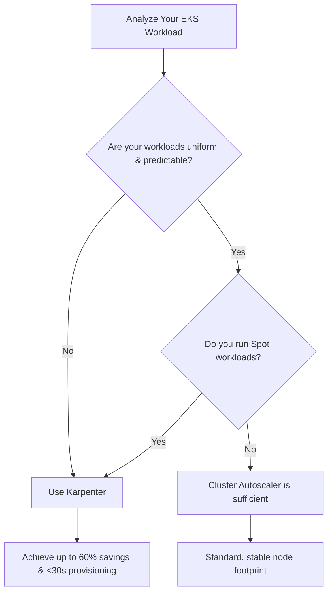

# Cost Optimization: Karpenter vs. Cluster Autoscaler

Kubernetes autoscaling is essential for matching infrastructure capacity to application demand. However, how an autoscaler provisions and depowers nodes has a massive impact on your monthly cloud bill. 

This document analyzes how **Karpenter** achieves superior cost optimization compared to the legacy **Cluster Autoscaler (CA)**.

---

## 1. Group-Based vs. Group-less Scaling

The fundamental architectural difference between Cluster Autoscaler and Karpenter dictates how cost-efficiently they can scale:

| Feature | Cluster Autoscaler (CA) | Karpenter |
| :--- | :--- | :--- |
| **Scaling Target** | Scales **Auto Scaling Groups (ASGs)** | Scales **Individual Instances** directly |
| **Instance Type Choices** | Homogeneous (ASG must be configured with a specific instance type or list of similar types) | Heterogeneous (Can choose dynamically from hundreds of instance families and sizes) |
| **Right-Sizing Capability** | Poor (Forces pods onto whatever instance type is defined in the active ASG) | Excellent (Directly provisions the cheapest instance size that fits the pending pod) |

### Cost Impact Scenario:
* **Workload**: A new pod requests **15 CPU** and **60 GB RAM**.
* **Cluster Autoscaler**: Must scale up the existing Node Group (e.g., configured with `m5.large` nodes offering 2 CPU and 8 GB RAM each). To schedule this single pod, CA must launch **8 instances of `m5.large`**, resulting in fragmented resources and high costs.
* **Karpenter**: Identifies the resource requests, evaluates AWS pricing, and directly provisions a single **`m5.4xlarge`** (16 CPU, 64 GB RAM). This right-sizing avoids cluster fragmentation and reduces idle CPU/Memory overhead, saving up to **30–50%** for large workloads.

---

## 2. Active Consolidation & Defragmentation

Cluster Autoscaler is passive when it comes to scaling down, whereas Karpenter actively defragments the cluster to minimize waste.

```
Cluster Autoscaler Scale-Down (Passive):
Node A (30% used) --------> Stays active (cooldown delay, wait 10m)
Node B (20% used) --------> Stays active (cannot dynamically merge different node sizes)

Karpenter Consolidation (Active):
Node A (30% used) \
                    ======> Karpenter provisions 1 cheaper Node C, 
Node B (20% used) /        drains A & B, and terminates A & B.
```

### Cluster Autoscaler Scale-Down
* Only monitors nodes that fall below a fixed request threshold (typically 50% CPU/Memory requests).
* Must wait for a cooling-down period (usually 10 minutes) before terminating a node.
* **Limitations**: CA cannot reorganize workloads across different node sizes. If Node A and Node B are both at 30% utilization, but they belong to different ASGs or cannot be merged into a homogeneous template, they both remain running.

### Karpenter Consolidation
Karpenter features a continuous optimization loop configured via `consolidationPolicy: WhenUnderutilized`:
* **Underutilized Node Replacement**: If a node is running at 20% capacity, Karpenter calculates if it is cheaper to spin up a smaller node type, move the pods there, and terminate the larger one.
* **Multi-Node Merging**: If multiple nodes are partially full, Karpenter simulates packing all those pods onto a single node. It provisions the new node, schedules the workloads, and deletes the old ones.
* **Immediate Scale-Down**: As soon as a node is empty, Karpenter terminates it immediately (no 10-minute cooldown required).

---

## 3. Spot Instance Optimization & Fallback

AWS Spot instances offer up to 90% savings over On-Demand, but managing their availability and interruptions is challenging.

### Spot with Cluster Autoscaler
To safely use Spot with CA, you must create and maintain multiple ASGs (e.g., one for each instance family and Availability Zone) to ensure diversification and prevent provisioning failures when Spot capacity is low. Furthermore:
* CA cannot easily fall back to On-Demand if Spot capacity is exhausted.
* If it does fall back (using priority expanders), CA will not automatically move workloads back to Spot when Spot capacity becomes available again.

### Spot with Karpenter
Karpenter simplifies and optimizes Spot orchestration:
* **Single NodePool**: You define a single NodePool that allows both `spot` and `on-demand` capacity types.
* **Spot-First Allocation**: Karpenter dynamically selects Spot instances first. It automatically chooses from a diversified list of instance types to minimize the risk of a Spot capacity stockout.
* **On-Demand Fallback**: If AWS runs out of Spot capacity for the required sizes, Karpenter automatically provisions On-Demand instances to keep your application online.
* **Re-Spotting**: When Spot capacity returns, Karpenter's consolidation engine detects that the On-Demand nodes can be replaced by cheaper Spot instances. It will gracefully launch Spot instances, move the pods, and terminate the On-Demand nodes.

---

## 4. Summary Comparison

| Optimization Feature | Cluster Autoscaler | Karpenter | Cost Impact |
| :--- | :--- | :--- | :--- |
| **Instance Right-Sizing** | Rigid (Fixed ASG size) | Dynamic (Bin-packs to cheapest size) | Saves **15% - 30%** by avoiding over-provisioned nodes. |
| **Scale-Down Trigger** | Underutilization threshold + 10m delay | Immediate on empty / Continuous bin-packing | Saves **10% - 25%** by cutting down idle node minutes. |
| **Cross-Node Consolidation** | No | Yes (Merges sparse nodes into single node) | Saves **20% - 40%** in highly dynamic or batch environments. |
| **Spot Orchestration** | Complex (Requires multiple ASGs) | Simple (One NodePool handles diversification) | Lowers management overhead; maximizes Spot usage. |
| **Spot to On-Demand Fallback** | Manual / Complex priority setups | Native & automatic | Ensures high availability without paying On-Demand prices permanently. |

## 5. Decision Matrix: Which One to Choose?

Use this flowchart to decide which autoscaler fits your cluster profile:



---

## 6. Real-World Cost Analysis (A Mathematical Comparison)

Let’s calculate the monthly cost difference for a representative development cluster:

### Workload Profile:
* **Daytime Baseline (22 hours/day)**: 20 microservices (each 0.5 CPU, 1 GB RAM) + 1 memory-heavy cache pod (4 CPU, 30 GB RAM). Total resource demand: **14 CPU, 50 GB RAM**.
* **Nighttime Batch Jobs (2 hours/day)**: 2 large jobs (each 10 CPU, 32 GB RAM). Peak workload demand additions: **20 CPU, 64 GB RAM**.

### Case A: Cluster Autoscaler (CA) with Homogeneous Nodes
* **Setup**: Configured with a single node group using `m5.xlarge` instances (4 CPU, 16 GB RAM) costing **$0.192 / hour** On-Demand.
* **Daytime Baseline**: To satisfy 14 CPU and 50 GB RAM, CA must run **4 nodes** of `m5.xlarge` (Total: 16 CPU, 64 GB RAM).
  * *Daytime Hourly Cost*: 4 * $0.192 = **$0.768 / hour**
* **Nighttime Peak**: Adding 20 CPU and 64 GB RAM pushes the total cluster needs to 34 CPU and 114 GB RAM. CA must scale up by adding 5 more `m5.xlarge` nodes. Total nodes = 9 (36 CPU, 144 GB RAM).
  * *Nighttime Hourly Cost*: 9 * $0.192 = **$1.728 / hour**
* **Daily Cost Math**:
  * Baseline: 22 hours * $0.768 = $16.896
  * Peak: 2 hours * $1.728 = $3.456
  * **Total Daily Cost**: $20.35
  * **Total Monthly Cost (30 days)**: **$610.56**

### Case B: Karpenter (Heterogeneous Nodes & Spot Instances)
* **Setup**: A single Karpenter NodePool allowing diverse Spot instance families (`c6i`, `m6i`, `r6i`).
* **Daytime Baseline**: Karpenter bin-packs the workload and selects:
  * 1 x `c6i.2xlarge` Spot (8 CPU, 16 GB RAM @ **$0.136 / hour**)
  * 1 x `r6i.2xlarge` Spot (8 CPU, 64 GB RAM @ **$0.201 / hour**)
  * *Daytime Hourly Cost*: $0.136 + $0.201 = **$0.337 / hour**
* **Nighttime Peak**: Karpenter detects the temporary 20 CPU and 64 GB RAM demand. Instead of launching multiple small nodes, it provisions a single **`c6i.4xlarge` Spot instance** (16 CPU, 32 GB RAM @ **$0.272 / hour**) and one **`m6i.2xlarge` Spot instance** (8 CPU, 32 GB RAM @ **$0.152 / hour**).
  * *Nighttime Hourly Cost*: Baseline ($0.337) + Peak ($0.272 + $0.152) = **$0.761 / hour**
* **Daily Cost Math**:
  * Baseline: 22 hours * $0.337 = $7.414
  * Peak: 2 hours * $0.761 = $1.522
  * **Total Daily Cost**: $8.936
  * **Total Monthly Cost (30 days)**: **$268.08**

### The Bottom Line
By switching to Karpenter, this workload achieves **56.1% monthly savings** ($342.48 saved per month) through:
1. **Dynamic Right-Sizing** (Heterogeneous instance choices matching workloads instead of rigid standard groups).
2. **First-Class Spot Integration** (Diversification across compute/memory-optimized families automatically).
3. **Instant Consolidation** (No 10-minute idle scaling delays at the end of the nightly batch jobs).

---

## Conclusion

While **Cluster Autoscaler** remains a stable and simple choice for rigid clusters with uniform workloads, **Karpenter** is the clear winner for modern, dynamic, and cost-conscious Kubernetes applications. By adopting Karpenter, organizations gain cloud resource flexibility while dramatically decreasing EKS spend.

