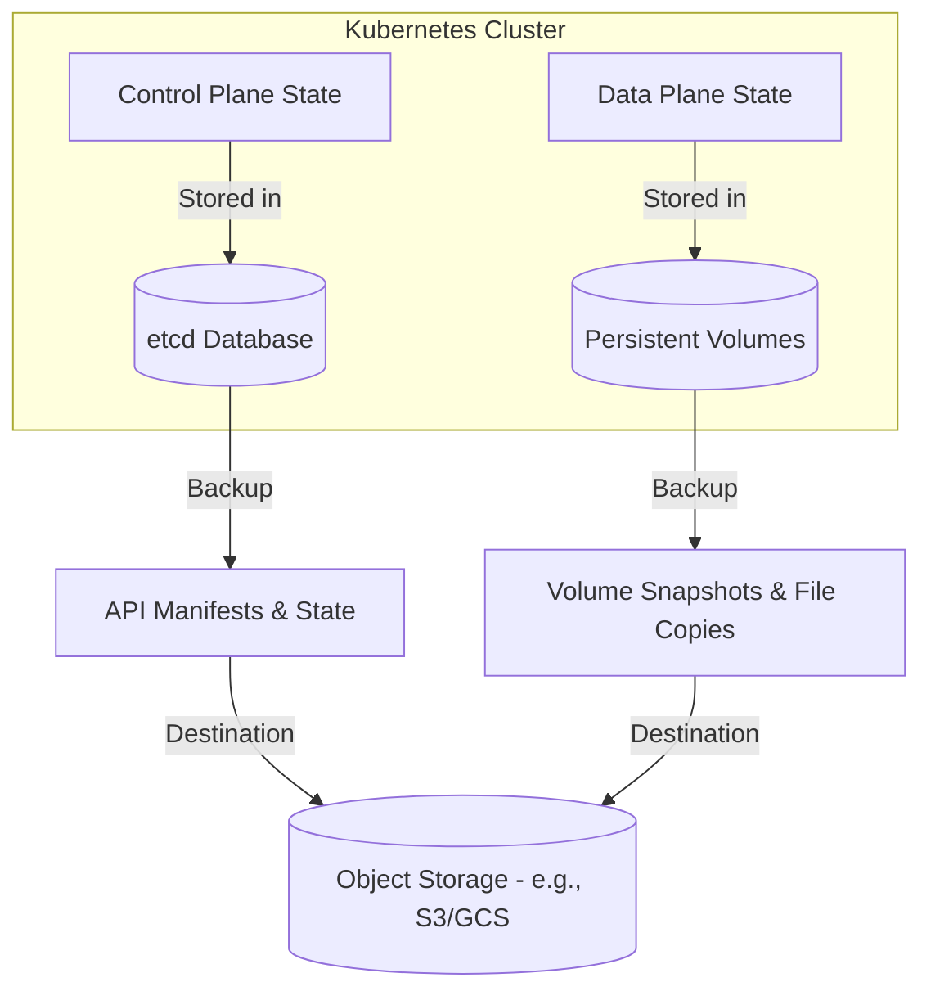

# Kubernetes Backup and Restore

Kubernetes has revolutionized how we deploy, scale, and manage containerized applications. However, because Kubernetes abstracts infrastructure, designing a robust **Backup and Disaster Recovery (DR)** strategy requires understanding both the **control plane state** (Kubernetes API resources) and the **data plane state** (Persistent Volumes).

This guide walks you through the fundamentals of Kubernetes backup and restore, compares the prominent tools in the ecosystem, details why **Velero** is the industry standard, and provides production-ready best practices.

---

## 1. Understanding Kubernetes Backup and Restore

A Kubernetes cluster's state is split into two distinct layers:



### A. Control Plane State (Declarative State)
*   **What it is:** The configuration of every object in the cluster—Namespaces, Deployments, Services, ConfigMaps, Secrets, Custom Resource Definitions (CRDs), RBAC roles, etc.
*   **Where it lives:** Inside the **etcd** key-value store.
*   **Backup Method:** 
    *   **etcd snapshots:** Captures the binary state of the database.
    *   **API resource extraction:** Querying the Kubernetes API server and exporting objects as JSON/YAML manifests.

### B. Data Plane State (Imperative State)
*   **What it is:** Actual application data stored in databases, caches, and file shares.
*   **Where it lives:** Inside **Persistent Volumes (PVs)** backed by cloud storage (AWS EBS, Google Persistent Disk, Azure Managed Disks) or on-prem storage arrays (Ceph, NFS, NetApp).
*   **Backup Method:**
    *   **CSI Volume Snapshots:** Point-in-time storage-level snapshots using Container Storage Interface (CSI) drivers.
    *   **File-system level backup:** Copying files directly out of the PVs using tools like Restic or Kopia.

> [!IMPORTANT]
> A complete Kubernetes backup must capture **both** the API resource definitions and the underlying PV data. Backing up only one of these leaves you with an incomplete restore state.

---

## 2. Comparing Kubernetes Backup Tools

Several tools address backup and restore in Kubernetes. They range from low-level command-line utilities to enterprise-grade management platforms.

| Feature | Velero | Kasten K10 (by Veeam) | Portworx PX-Backup | `etcdctl` (Custom Scripts) |
| :--- | :--- | :--- | :--- | :--- |
| **License** | Open-Source (Apache 2.0) | Proprietary (Free tier available) | Proprietary (Enterprise) | Open-Source (CoreOS/CNCF) |
| **Scope** | Cluster API & Volume Data | Application-Centric & Multi-Cluster | Multi-Cloud/Multi-Cluster | Control Plane State Only |
| **UI / Dashboard**| CLI-only (Official) / Third-party UIs | Rich Web UI | Rich Web UI | CLI-only |
| **Volume Backup** | CSI Snapshots, Restic, Kopia | CSI Snapshots, Direct Storage Integrations | CSI Snapshots, Portworx integration | None (Requires manual scripting) |
| **Hooks Support** | Yes (Pre/Post-backup & restore) | Yes (Extensive Blueprints) | Yes | No |
| **Target Audience**| Platform Engineers, DevOps | Enterprise DR Teams | Enterprise Portworx Users | Cluster Administrators |

### Detailed Analysis of Alternative Tools

*   **Kasten K10 (by Veeam):** A powerful enterprise tool with a rich GUI, automated application discovery, and deep policy management. It is ideal for large enterprise environments with strict compliance and monitoring needs, though it comes with licensing costs.
*   **Portworx PX-Backup:** Specifically designed to manage backups across multi-cloud and multi-cluster environments. It integrates tightly with Portworx Enterprise storage but can run on any Kubernetes cluster.
*   **`etcdctl`:** The native CLI for managing etcd. While great for taking raw database snapshots, it is **not sufficient for application backups** because it restores the entire cluster back in time (disrupting unaffected workloads) and does not back up Persistent Volumes.

---

## 3. Why Velero?

**Velero** (formerly Heptio Ark, now maintained by VMware/Tanzu and part of the CNCF) is widely considered the de facto standard for Kubernetes backup and restore. 

```
                                    +-----------------------+
                                    |      Velero Pod       |
                                    +-----------+-----------+
                                                |
                      +-------------------------+-------------------------+
                      |                                                   |
                      v                                                   v
         +------------+------------+                         +------------+------------+
         | Backup/Restore Controller|                         |  CSI / Storage Plugins  |
         +------------+------------+                         +------------+------------+
                      |                                                   |
         Queries Kubernetes API and                          Interacts with Storage Provider
         archives resources as a tarball.                     to snapshot Persistent Volumes.
                      |                                                   |
                      v                                                   v
         +------------+------------+                         +------------+------------+
         |    S3 / Object Store    | <---------------------- |   Cloud Provider / EBS  |
         +-------------------------+   (Uploads metadata &   +-------------------------+
                                        volume data/snapshots)
```

Here is why organizations choose Velero:

1.  **Declarative, Resource-Aware Back-ups:**
    Instead of performing raw block-level copies of the master node disks, Velero queries the Kubernetes API server to capture resources. This allows Velero to restore backups to different namespaces, different cloud providers, or even newer versions of Kubernetes.
2.  **CSI (Container Storage Interface) Integration:**
    Velero utilizes standard Kubernetes CSI snapshot APIs, allowing it to trigger point-in-time snapshots across any storage provider that supports CSI (AWS, GCP, Azure, vSphere, Ceph, etc.).
3.  **File-System Backups (Restic & Kopia Integration):**
    For storage providers that do not support CSI snapshots, Velero integrates with **Restic** and **Kopia**. This enables file-system-level backups of Persistent Volumes directly to object storage.
4.  **Backup/Restore Hooks (Application Consistency):**
    Velero allows you to run custom commands inside your application containers immediately before a backup begins and after it finishes. For example, you can run `fsync` and `lock` commands on a database container to ensure zero data corruption during the snapshot.
5.  **Multi-Cloud Portability & Migrations:**
    Because Velero backups are stored as metadata tarballs and storage snapshots, you can back up a namespace in AWS EKS and restore it directly into Google GKE or an on-premises OpenShift cluster.
6.  **Helm-Friendly Installation & GitOps Integration:**
    Velero can be deployed entirely via Helm and configured declaratively using Custom Resource Definitions (`Backup`, `Restore`, `Schedule`, `BackupStorageLocation`). This makes it easy to integrate Velero into GitOps pipelines (ArgoCD, Flux).

---

## 4. Kubernetes Backup Best Practices

Implementing a backup tool is only half the battle. To guarantee that you can recover from a disaster, follow these production-proven best practices:

### A. Protect the Backup Destination (Ransomware Protection)
Your backups are a prime target for ransomware. If an attacker gains access to your Kubernetes cluster, they will attempt to delete your backups.
*   **Enable S3 Object Lock (WORM):** Configure your target S3 bucket with Write-Once-Read-Many (WORM) policies in compliance mode to prevent backups from being deleted or overwritten before their retention period ends.
*   **Enable Bucket Versioning:** Ensure that every delete request creates a delete marker instead of permanently erasing the backup metadata.
*   **Use IAM Roles for Service Accounts (IRSA):** Never hardcode AWS Access Keys inside your cluster. Use IRSA (IAM OIDC providers) to bind a secure AWS IAM Role directly to the Velero service account.

### B. Automate and Schedule with TTLs
*   **Never Rely on Manual Backups:** Set up hourly/daily backup schedules.
*   **Set Time-to-Live (TTL):** Backups should not accumulate forever. Set a strict TTL (e.g., `30d` for daily backups, `7d` for hourly backups) to manage storage costs and comply with data privacy laws (like GDPR).
    ```bash
    velero schedule create daily-backup --schedule="0 1 * * *" --ttl 720h0m0s
    ```

### C. Ensure Application Consistency (Database Backups)
Taking a storage snapshot of an active database can result in a corrupted or "crash-inconsistent" restore.
*   **Use Backup Hooks:** Freeze database writes before the snapshot and unfreeze them afterward.
*   **Alternative - Logical Backups:** For transactional databases (PostgreSQL, MySQL), run a sidecar or cron job that performs a logical dump (e.g., `pg_dump`) to a local volume *before* Velero takes the snapshot.

### D. Practice "Restoring" (Verify Your DR Plan)
A backup is only as good as its restore. A common failure point in DR is finding out your backup is unreadable only when a real outage occurs.
*   **Automate Recovery Drills:** Set up a secondary staging or test cluster and run automated scripts that restore a random production backup namespace once a week/month to verify health.
*   **Document the Recovery Time Objective (RTO) and Recovery Point Objective (RPO):** Know exactly how much data you can afford to lose (RPO) and how long it will take you to bring services back online (RTO).

### E. Monitor and Alert
*   **Prometheus Metrics:** Velero exposes standard Prometheus metrics (e.g., `velero_backup_last_status`, `velero_backup_failure_total`). Integrate these into Grafana and set up alerts via Alertmanager or PagerDuty to notify the platform team immediately if a scheduled backup fails.
*   **Slack Notifications:** Configure webhooks or operator integrations to push backup summaries into engineering Slack channels.

---

## 5. Summary Checklist for Cluster Administrators

- [ ] **Infrastructure:** Dedicated S3 bucket with Versioning & Object Lock enabled.
- [ ] **Identity:** Velero service account configured with AWS IRSA (least privilege policy).
- [ ] **Configuration:** Velero installed using Helm with CSI plugins configured.
- [ ] **Schedules:** Production workloads backed up on a recurring cron schedule.
- [ ] **Hooks:** Critical database pods annotated with pre/post backup hooks.
- [ ] **DR Playbook:** A written and tested runbook detailing how to restore namespaces in the event of an EKS cluster deletion.
