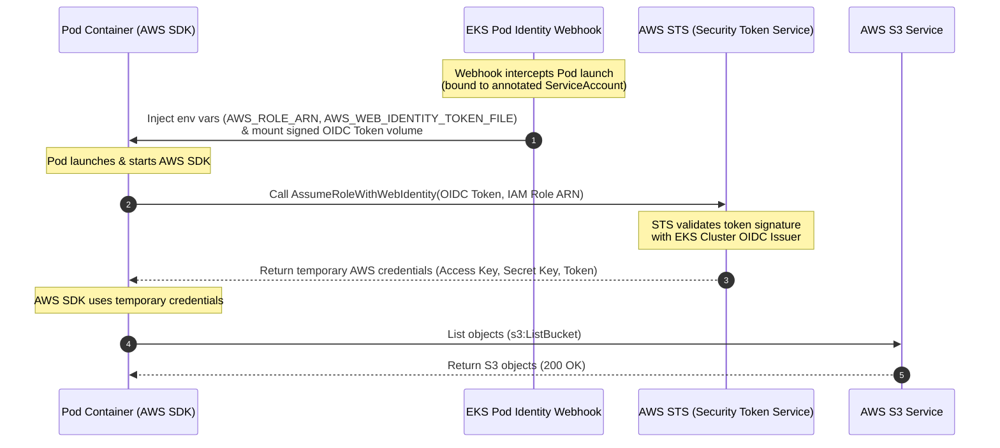

# Pod to AWS Communication (IAM Roles for Service Accounts - IRSA)

This lab guide explains how applications running inside EKS pods securely authenticate with AWS services (like S3, DynamoDB, or KMS) without storing static AWS access keys inside the containers. You will configure **IAM Roles for Service Accounts (IRSA)**, deploy a test pod running the AWS CLI, and verify access.

---

## Overview

```
Step 1 → Create a Private S3 Target Bucket
Step 2 → Deploy a Test Pod (Default ServiceAccount) & Observe the Access Failure
Step 3 → Create an IAM Policy & Federated Role
Step 4 → Create and Annotate a Kubernetes ServiceAccount
Step 5 → Redeploy the Pod Bound to the IRSA ServiceAccount
Step 6 → Verify Secure AWS Resource Access
```

---

## Step 1 — Create a Private S3 Target Bucket

Let's create a secure S3 bucket that our pod will access (replace `student1` with your name to ensure global uniqueness):

```bash
# Create the S3 bucket in us-east-2
aws s3api create-bucket \
  --bucket student1-irsa-demo-bucket \
  --region us-east-2 \
  --create-bucket-configuration LocationConstraint=us-east-2

# Upload a dummy file to test read access
echo "Hello from AWS S3, authorized via EKS IRSA!" > test-file.txt
aws s3 cp test-file.txt s3://student1-irsa-demo-bucket/
```

---

## Step 2 — Deploy a Test Pod (Default ServiceAccount) & Observe the Access Failure

Before configuring IRSA, let's prove that a Pod has **no AWS permissions by default** — it only has a Kubernetes identity, not an AWS one.

```bash
kubectl create namespace irsa-demo
```

### 2a. Create the Pod manifest (`aws-cli-pod.yaml`)
Create a file named `aws-cli-pod.yaml` with the following content. Notice there is **no `serviceAccountName`** set, so it runs under the namespace's `default` ServiceAccount:

```yaml
apiVersion: v1
kind: Pod
metadata:
  name: aws-cli-pod
  namespace: irsa-demo
spec:
  containers:
  - name: aws-cli
    image: amazon/aws-cli:latest
    command: ["sleep", "3600"] # Keep container alive
```

### 2b. Apply the pod and wait for it to run
```bash
kubectl apply -f aws-cli-pod.yaml
kubectl wait --for=condition=Ready pod/aws-cli-pod -n irsa-demo --timeout=60s
```

### 2c. Try to access the S3 bucket from inside the pod
```bash
kubectl exec -it aws-cli-pod -n irsa-demo -- aws s3 ls s3://student1-irsa-demo-bucket
```

*   **Result**: `Unable to locate credentials`

> **Key Learning**: The Pod has no AWS identity at all — the AWS CLI can't find any credentials to sign the request with. Even if it could, a plain Kubernetes ServiceAccount carries no AWS IAM permissions. This is the exact gap that **IRSA** closes: it federates the Pod's Kubernetes ServiceAccount identity to a real AWS IAM Role via OIDC.

---

## Step 3 — Create an IAM Policy and Federated Role

We must create an IAM Role that trusts the EKS OIDC provider and grants read-only access to our S3 bucket.

### 3a. Create the S3 Read-Only IAM Policy
Create a file named `s3-policy.json` with the following content:

```json
{
    "Version": "2012-10-17",
    "Statement": [
        {
            "Effect": "Allow",
            "Action": [
                "s3:ListBucket"
            ],
            "Resource": "arn:aws:s3:::student1-irsa-demo-bucket"
        },
        {
            "Effect": "Allow",
            "Action": [
                "s3:GetObject"
            ],
            "Resource": "arn:aws:s3:::student1-irsa-demo-bucket/*"
        }
    ]
}
```

Deploy the policy in AWS:
```bash
aws iam create-policy \
  --policy-name EKS-S3-ReadPolicy-student1 \
  --policy-document file://s3-policy.json
```

---

### 3b. Create the Federated IAM Trust Policy
We need to configure the role trust relationship to allow EKS OIDC token logins:

1.  **Retrieve EKS cluster OIDC Provider and Account Details**:
    ```bash
    OIDC_PROVIDER=$(aws eks describe-cluster --name student1 --query "cluster.identity.oidc.issuer" --output text | sed -e "s/https:\/\///")
    ACCOUNT_ID=$(aws sts get-caller-identity --query Account --output text)
    ```

2.  **Create the Trust Policy file**:
    ```bash
    cat <<EOF > trust-policy.json
    {
      "Version": "2012-10-17",
      "Statement": [
        {
          "Effect": "Allow",
          "Principal": {
            "Federated": "arn:aws:iam://${ACCOUNT_ID}:oidc-provider/${OIDC_PROVIDER}"
          },
          "Action": "sts:AssumeRoleWithWebIdentity",
          "Condition": {
            "StringEquals": {
              "${OIDC_PROVIDER}:sub": "system:serviceaccount:irsa-demo:s3-reader-sa",
              "${OIDC_PROVIDER}:aud": "sts.amazonaws.com"
            }
          }
        }
      ]
    }
    EOF
    ```

3.  **Create the Role and Attach the Policy**:
    ```bash
    # Create the IAM role
    aws iam create-role \
      --role-name EKSS3AccessRole-student1 \
      --assume-role-policy-document file://trust-policy.json

    # Attach the S3 policy
    aws iam attach-role-policy \
      --role-name EKSS3AccessRole-student1 \
      --policy-arn arn:aws:iam://${ACCOUNT_ID}:policy/EKS-S3-ReadPolicy-student1
    ```

---

## Step 4 — Create and Annotate a Kubernetes ServiceAccount

We will map the IAM Role to a Kubernetes ServiceAccount using the **annotation** metadata field. This is what the EKS Pod Identity Webhook uses to know which IAM Role to federate.

### 4a. Create the ServiceAccount manifest (`irsa-sa.yaml`)
Create a file named `irsa-sa.yaml` with the following content (replace `ACCOUNT_ID` with your actual AWS Account ID):

```yaml
apiVersion: v1
kind: ServiceAccount
metadata:
  name: s3-reader-sa
  namespace: irsa-demo
  annotations:
    eks.amazonaws.com/role-arn: arn:aws:iam::ACCOUNT_ID:role/EKSS3AccessRole-student1
```

### 4b. Apply the manifest
```bash
kubectl apply -f irsa-sa.yaml
```

---

## Step 5 — Redeploy the Pod Bound to the IRSA ServiceAccount

Now let's fix the failure from Step 2 by rebinding the Pod to our newly annotated `s3-reader-sa` ServiceAccount instead of `default`.

### 5a. Delete the old pod and create the fixed Pod manifest (`irsa-pod.yaml`)
```bash
kubectl delete pod aws-cli-pod -n irsa-demo
```

Create a file named `irsa-pod.yaml` with the following content:

```yaml
apiVersion: v1
kind: Pod
metadata:
  name: aws-cli-pod
  namespace: irsa-demo
spec:
  serviceAccountName: s3-reader-sa # Bind to our annotated SA
  containers:
  - name: aws-cli
    image: amazon/aws-cli:latest
    command: ["sleep", "3600"] # Keep container alive
```

### 5b. Apply the pod
```bash
kubectl apply -f irsa-pod.yaml
```

Verify the pod is running:
```bash
kubectl get pods -n irsa-demo
```

---

## Step 6 — Verify Secure AWS Resource Access

Let's exec into the pod and verify that the container can now read S3 objects using the federated identity.

1.  Open a shell inside the container:
    ```bash
    kubectl exec -it aws-cli-pod -n irsa-demo -- bash
    ```

2.  Verify the environment variables injected by EKS:
    ```bash
    env | grep AWS
    ```
    *   **Result**: You will see:
        *   `AWS_ROLE_ARN=arn:aws:iam::ACCOUNT_ID:role/EKSS3AccessRole-student1`
        *   `AWS_WEB_IDENTITY_TOKEN_FILE=/var/run/secrets/eks.amazonaws.com/serviceaccount/token`

3.  Query the S3 bucket using the AWS CLI:
    ```bash
    aws s3 ls s3://student1-irsa-demo-bucket
    ```
    *   **Result**: Displays `test-file.txt` (Success! The pod successfully assumed the role and listed the bucket contents).

4.  Read the S3 file content:
    ```bash
    aws s3 cp s3://student1-irsa-demo-bucket/test-file.txt -
    ```
    *   **Result**: Prints `Hello from AWS S3, authorized via EKS IRSA!`.

5.  Confirm that access is blocked for other buckets:
    ```bash
    # Try to list a non-authorized S3 bucket or all buckets
    aws s3 ls
    ```
    *   **Result**: `An error occurred (AccessDenied) when calling the ListBuckets operation` (Success! The IAM policy restricts access to our single target bucket).

Exit the container:
```bash
exit
```

---

## IRSA Authentication Flow (OIDC Federation)

IRSA leverages OpenID Connect (OIDC) identity federation to trade a Kubernetes ServiceAccount token for temporary AWS IAM security credentials:


