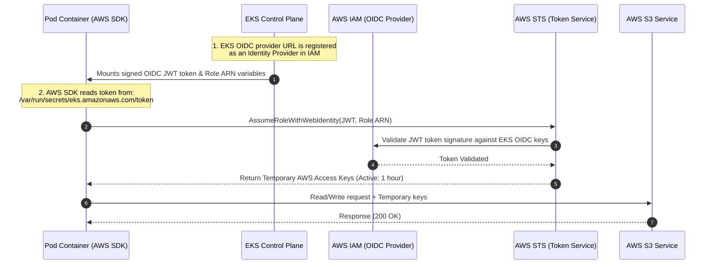

# Architectural Guide: Understanding EKS OIDC Provider & IRSA

This document explains the role of the **OpenID Connect (OIDC) Identity Provider** in Amazon EKS and why it is the security foundation for **IAM Roles for Service Accounts (IRSA)**.

---

## Simple Explanation (No Prior AWS/Kubernetes Knowledge Needed)

Think of it like a **hotel key card system**:

- **The hotel (AWS)** doesn't just hand out a master key to every room. Instead, guests get a **key card** that only opens *their* room.
- **The front desk (AWS IAM)** is the only place that can program key cards, and it only does so for guests it trusts.
- **The cluster (EKS)** is like a *trusted travel agency* that the hotel has a special agreement with: "If the travel agency vouches for a guest with a signed voucher, we'll issue that guest a key card — but only for the exact room they booked."
- **The pod (your application)** is the guest. It shows up holding a **signed voucher** (the OIDC token) that says who it is.
- **The OIDC Provider** is that trust agreement between the hotel and the travel agency — it's what lets the hotel say "yes, I recognize vouchers from this agency" instead of requiring every guest to already have a hotel account.
- **IRSA** is the process of the guest handing over their voucher, the hotel checking it against the agreement, and — if it matches — handing back a **temporary key card** (temporary AWS credentials) that expires in an hour and only opens the one room (S3 bucket, database, etc.) they're allowed into.

In plain terms:

| Analogy | Real Concept |
|---|---|
| Hotel | AWS |
| Front desk | AWS IAM |
| Travel agency | Amazon EKS cluster |
| Trust agreement between hotel & agency | OIDC Identity Provider |
| Guest | Pod / application |
| Signed voucher | OIDC JWT token mounted into the Pod |
| Temporary key card | Temporary AWS credentials from STS |
| One room only, card expires in 1 hour | Least-privilege IAM Role, valid ~60 minutes |

**Why not just give every guest a master key (put credentials on the node)?** Because if one guest's room is compromised, the attacker now has a master key to *every* room in the hotel. That's exactly the problem described below with node-level IAM roles.

---

## The Security Problem: Node-Level vs. Pod-Level Permissions


Before the introduction of EKS OIDC Identity Federation, if a pod needed to write to an AWS S3 bucket, platform engineers had to use one of two insecure methods:

```
❌ Insecure Option A: Hardcoded AWS Credentials
   [Pod (Hardcoded Keys)] ──> Access Key / Secret Key stored on disk ──> Security Risk (Leaked Keys)

❌ Insecure Option B: Over-privileged Node Role
   [Pod 1 (Web Frontend)] ──┐
   [Pod 2 (S3 Processor)] ──┼──> Shares [EC2 Node IAM Role (S3 Permissions)] ──> Violates Least Privilege
   [Pod 3 (Compromised)]  ──┘
```

By putting S3 permissions on the EC2 worker node, **every pod on that node** gets S3 access. If an attacker compromises a simple web frontend container, they can access the S3 credentials immediately.

---

## The Solution: OIDC Provider & IRSA (Pod-Level Security)

EKS solves this by generating a unique **OIDC Issuer URL** for your cluster. By registering this OIDC URL with AWS IAM as an **Identity Provider**, you establish a federated trust relationship:

```
🔒 Secure Option: IAM Roles for Service Accounts (IRSA)
   [Pod 1 (Web Frontend)] ──> ServiceAccount (No IAM bindings) ──> Blocked from S3 ❌
   [Pod 2 (S3 Processor)] ──> ServiceAccount (Annotated with Role ARN) ──> STS AssumeRole ──> Allowed S3 Access ✅
```

---

## Token Exchange Architecture (Mermaid)

The sequence diagram below shows how the OIDC Provider bridges authentication between your Kubernetes pod and AWS services:



---

## Anatomy of the Trust Relationship Policy

The link between Kubernetes and AWS is enforced by the **AssumeRoleWithWebIdentity** trust policy on the IAM Role. 

Here is a typical trust policy configured during your labs:

```json
{
  "Version": "2012-10-17",
  "Statement": [
    {
      "Effect": "Allow",
      "Principal": {
        "Federated": "arn:aws:iam::111122223333:oidc-provider/oidc.eks.us-east-2.amazonaws.com/id/EXAMPLE123456"
      },
      "Action": "sts:AssumeRoleWithWebIdentity",
      "Condition": {
        "StringEquals": {
          "oidc.eks.us-east-2.amazonaws.com/id/EXAMPLE123456:sub": "system:serviceaccount:irsa-demo:s3-reader-sa",
          "oidc.eks.us-east-2.amazonaws.com/id/EXAMPLE123456:aud": "sts.amazonaws.com"
        }
      }
    }
  ]
}
```

### Key Security Safeguards in the Policy:

1.  **`Principal.Federated`**: Declares that only your EKS cluster's unique OIDC provider is allowed to log in to this IAM role.
2.  **`Action: sts:AssumeRoleWithWebIdentity`**: Tells AWS that this role can only be assumed using a Web Identity Token (the Kubernetes OIDC JWT token). You cannot assume this role using standard console logins or basic AWS access keys.
3.  **`Condition ... :sub`**: This is the **most critical security constraint**. It restricts role assumption **strictly** to a specific Kubernetes namespace and service account name (`system:serviceaccount:<namespace>:<serviceaccount-name>`). Even if other pods in different namespaces steal the token, AWS will block access because their metadata doesn't match this exact subject string.
4.  **`Condition ... :aud`**: Restricts the audience of the token to `sts.amazonaws.com` (AWS Security Token Service) ensuring the token cannot be reused for other third-party APIs.

---

## Why EKS OIDC & IRSA is a Production Requirement

*   **Zero Hardcoded Secrets**: Developers do not need to manage, store, or rotate AWS access keys. Keys are completely ephemeral, generated by AWS STS, and rotated automatically every 60 minutes.
*   **True Least Privilege**: Permissions are locked down at the container pod-level. Web pods, database pods, and messaging pods have completely distinct, isolated access boundaries.
*   **AWS CloudTrail Auditability**: All AWS service operations are logged under the specific assumed IAM role session name (which includes the EKS pod ID). This gives security auditors a complete, end-to-end log of exactly which pod made which API call.
