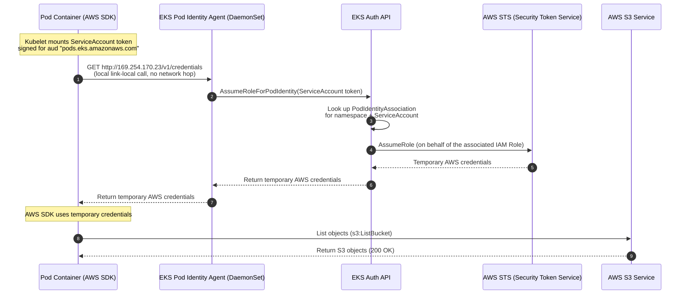

# Pod to AWS Communication (Amazon EKS Pod Identity)

This lab guide explains how applications running inside EKS pods securely authenticate with AWS services (like S3, DynamoDB, or KMS) using **Amazon EKS Pod Identity** — the newer, simpler alternative to IRSA. You will associate an IAM Role directly with a Kubernetes ServiceAccount via the EKS Pod Identity Agent, deploy a test pod running the AWS CLI, and verify access.

---

## Overview

```
Step 1 → Create a Private S3 Target Bucket
Step 2 → Deploy a Test Pod (Default ServiceAccount) & Observe the Access Failure
Step 3 → Install the EKS Pod Identity Agent Addon
Step 4 → Create an IAM Policy & Role (Trusting the Pods Identity Service)
Step 5 → Create the Pod Identity Association (ServiceAccount ↔ IAM Role)
Step 6 → Redeploy the Pod Bound to the ServiceAccount
Step 7 → Verify Secure AWS Resource Access
```

---

## Step 1 — Create a Private S3 Target Bucket

Let's create a secure S3 bucket that our pod will access (replace `student1` with your name to ensure global uniqueness):

```bash
# Create the S3 bucket in us-east-2
aws s3api create-bucket \
  --bucket student1-podidentity-demo-bucket \
  --region us-east-2 \
  --create-bucket-configuration LocationConstraint=us-east-2

# Upload a dummy file to test read access
echo "Hello from AWS S3, authorized via EKS Pod Identity!" > test-file.txt
aws s3 cp test-file.txt s3://student1-podidentity-demo-bucket/
```

---

## Step 2 — Deploy a Test Pod (Default ServiceAccount) & Observe the Access Failure

Before configuring Pod Identity, let's prove that a Pod has **no AWS permissions by default** — it only has a Kubernetes identity, not an AWS one.

```bash
kubectl create namespace podidentity-demo
```

### 2a. Create the Pod manifest (`aws-cli-pod.yaml`)
Create a file named `aws-cli-pod.yaml` with the following content. Notice there is **no `serviceAccountName`** set, so it runs under the namespace's `default` ServiceAccount:

```yaml
apiVersion: v1
kind: Pod
metadata:
  name: aws-cli-pod
  namespace: podidentity-demo
spec:
  containers:
  - name: aws-cli
    image: amazon/aws-cli:latest
    command: ["sleep", "3600"] # Keep container alive
```

### 2b. Apply the pod and wait for it to run
```bash
kubectl apply -f aws-cli-pod.yaml
kubectl wait --for=condition=Ready pod/aws-cli-pod -n podidentity-demo --timeout=60s
```

### 2c. Try to access the S3 bucket from inside the pod
```bash
kubectl exec -it aws-cli-pod -n podidentity-demo -- aws s3 ls s3://student1-podidentity-demo-bucket
```

*   **Result**: `Unable to locate credentials`

> **Key Learning**: The Pod has no AWS identity at all — the AWS CLI can't find any credentials to sign the request with. **EKS Pod Identity** closes this gap by having an in-cluster agent hand the Pod temporary AWS credentials for a Role that's associated with its ServiceAccount — no OIDC trust policy required.

---

## Step 3 — Install the EKS Pod Identity Agent Addon

Pod Identity requires the `eks-pod-identity-agent` addon running as a DaemonSet on your cluster. Install it if it isn't already present:

```bash
aws eks create-addon \
  --cluster-name student1 \
  --addon-name eks-pod-identity-agent
```

Verify the addon is active:
```bash
aws eks describe-addon \
  --cluster-name student1 \
  --addon-name eks-pod-identity-agent \
  --query "addon.status"
```

Confirm the agent Pods are running in `kube-system`:
```bash
kubectl get pods -n kube-system -l app.kubernetes.io/name=eks-pod-identity-agent
```

---

## Step 4 — Create an IAM Policy and Role (Trusting the Pods Identity Service)

Unlike IRSA, the IAM Role's trust policy doesn't need your cluster's OIDC provider — it trusts the generic `pods.eks.amazonaws.com` service principal instead.

### 4a. Create the S3 Read-Only IAM Policy
Create a file named `s3-policy.json` with the following content:

```json
{
    "Version": "2012-10-17",
    "Statement": [
        {
            "Effect": "Allow",
            "Action": [
                "s3:ListBucket"
            ],
            "Resource": "arn:aws:s3:::student1-podidentity-demo-bucket"
        },
        {
            "Effect": "Allow",
            "Action": [
                "s3:GetObject"
            ],
            "Resource": "arn:aws:s3:::student1-podidentity-demo-bucket/*"
        }
    ]
}
```

Deploy the policy in AWS:
```bash
aws iam create-policy \
  --policy-name EKS-PodIdentity-S3ReadPolicy-student1 \
  --policy-document file://s3-policy.json
```

### 4b. Create the Trust Policy for the Pod Identity Service

```bash
cat <<EOF > trust-policy.json
{
  "Version": "2012-10-17",
  "Statement": [
    {
      "Effect": "Allow",
      "Principal": {
        "Service": "pods.eks.amazonaws.com"
      },
      "Action": [
        "sts:AssumeRole",
        "sts:TagSession"
      ]
    }
  ]
}
EOF
```

### 4c. Create the Role and Attach the Policy

```bash
ACCOUNT_ID=$(aws sts get-caller-identity --query Account --output text)

# Create the IAM role
aws iam create-role \
  --role-name EKSPodIdentityS3AccessRole-student1 \
  --assume-role-policy-document file://trust-policy.json

# Attach the S3 policy
aws iam attach-role-policy \
  --role-name EKSPodIdentityS3AccessRole-student1 \
  --policy-arn arn:aws:iam::${ACCOUNT_ID}:policy/EKS-PodIdentity-S3ReadPolicy-student1
```

> **Key Learning**: There is no `sub`/`aud` OIDC condition to hand-craft here — the trust relationship is generic. The precise mapping from ServiceAccount to Role happens separately, in the **Pod Identity Association** (Step 5), which AWS manages instead of Kubernetes annotations.

---

## Step 5 — Create the Pod Identity Association (ServiceAccount ↔ IAM Role)

First, create the plain (unannotated) Kubernetes ServiceAccount:

```bash
cat <<EOF | kubectl apply -f -
apiVersion: v1
kind: ServiceAccount
metadata:
  name: s3-reader-sa
  namespace: podidentity-demo
EOF
```

Now create the association in AWS that links this ServiceAccount to the IAM Role:

```bash
aws eks create-pod-identity-association \
  --cluster-name student1 \
  --namespace podidentity-demo \
  --service-account s3-reader-sa \
  --role-arn arn:aws:iam::${ACCOUNT_ID}:role/EKSPodIdentityS3AccessRole-student1
```

Verify the association:
```bash
aws eks list-pod-identity-associations --cluster-name student1
```

> **Key Learning**: Notice the ServiceAccount itself carries **no annotation** — the Role mapping lives entirely in AWS as an API object (`PodIdentityAssociation`), not in Kubernetes metadata. This makes the mapping visible/auditable directly from the AWS side and decouples it from `kubectl apply` access.

---

## Step 6 — Redeploy the Pod Bound to the ServiceAccount

Now let's fix the failure from Step 2 by rebinding the Pod to our newly associated `s3-reader-sa` ServiceAccount instead of `default`.

### 6a. Delete the old pod and create the fixed Pod manifest (`podidentity-pod.yaml`)
```bash
kubectl delete pod aws-cli-pod -n podidentity-demo
```

Create a file named `podidentity-pod.yaml` with the following content:

```yaml
apiVersion: v1
kind: Pod
metadata:
  name: aws-cli-pod
  namespace: podidentity-demo
spec:
  serviceAccountName: s3-reader-sa # Bind to our associated SA
  containers:
  - name: aws-cli
    image: amazon/aws-cli:latest
    command: ["sleep", "3600"] # Keep container alive
```

### 6b. Apply the pod
```bash
kubectl apply -f podidentity-pod.yaml
```

Verify the pod is running:
```bash
kubectl get pods -n podidentity-demo
```

---

## Step 7 — Verify Secure AWS Resource Access

Let's exec into the pod and verify that the container can now read S3 objects using the federated Pod Identity.

1.  Open a shell inside the container:
    ```bash
    kubectl exec -it aws-cli-pod -n podidentity-demo -- bash
    ```

2.  Verify the environment variables injected by the Pod Identity Agent:
    ```bash
    env | grep AWS
    ```
    *   **Result**: You will see:
        *   `AWS_CONTAINER_CREDENTIALS_FULL_URI=http://169.254.170.23/v1/credentials`
        *   `AWS_CONTAINER_AUTHORIZATION_TOKEN_FILE=/var/run/secrets/pods.eks.amazonaws.com/serviceaccount/eks-pod-identity-token`

    > Notice this is a completely different credential-delivery mechanism than IRSA's `AWS_ROLE_ARN` / `AWS_WEB_IDENTITY_TOKEN_FILE` — credentials are fetched from a local link-local endpoint served by the Pod Identity Agent DaemonSet, rather than assumed directly via STS web identity federation inside the SDK.

3.  Query the S3 bucket using the AWS CLI:
    ```bash
    aws s3 ls s3://student1-podidentity-demo-bucket
    ```
    *   **Result**: Displays `test-file.txt` (Success! The pod successfully obtained credentials and listed the bucket contents).

4.  Read the S3 file content:
    ```bash
    aws s3 cp s3://student1-podidentity-demo-bucket/test-file.txt -
    ```
    *   **Result**: Prints `Hello from AWS S3, authorized via EKS Pod Identity!`.

5.  Confirm that access is blocked for other buckets:
    ```bash
    # Try to list a non-authorized S3 bucket or all buckets
    aws s3 ls
    ```
    *   **Result**: `An error occurred (AccessDenied) when calling the ListBuckets operation` (Success! The IAM policy restricts access to our single target bucket).

Exit the container:
```bash
exit
```

---

## Clean Up

```bash
aws eks delete-pod-identity-association \
  --cluster-name student1 \
  --association-id $(aws eks list-pod-identity-associations --cluster-name student1 --namespace podidentity-demo --service-account s3-reader-sa --query "associations[0].associationId" --output text)

aws iam detach-role-policy --role-name EKSPodIdentityS3AccessRole-student1 --policy-arn arn:aws:iam::${ACCOUNT_ID}:policy/EKS-PodIdentity-S3ReadPolicy-student1
aws iam delete-role --role-name EKSPodIdentityS3AccessRole-student1
aws iam delete-policy --policy-arn arn:aws:iam::${ACCOUNT_ID}:policy/EKS-PodIdentity-S3ReadPolicy-student1

aws s3 rm s3://student1-podidentity-demo-bucket --recursive
aws s3api delete-bucket --bucket student1-podidentity-demo-bucket --region us-east-2

kubectl delete namespace podidentity-demo
```

---

## Pod Identity Authentication Flow



---

## IRSA vs. EKS Pod Identity — Key Differences

| Aspect | IRSA (IAM Roles for Service Accounts) | EKS Pod Identity |
|---|---|---|
| Underlying mechanism | OIDC federation — Pod token validated against the cluster's OIDC issuer | AWS-native `PodIdentityAssociation` API, no OIDC provider needed |
| Cluster prerequisite | An IAM OIDC provider must be associated with the cluster | The `eks-pod-identity-agent` EKS addon must be installed |
| Role ↔ ServiceAccount mapping | Stored as an **annotation** on the Kubernetes ServiceAccount (`eks.amazonaws.com/role-arn`) | Stored as an **AWS API object** (`aws eks create-pod-identity-association`), not in Kubernetes metadata |
| IAM trust policy | Must reference the cluster-specific OIDC provider ARN + `sub`/`aud` conditions | Generic trust for `pods.eks.amazonaws.com` service principal — no per-cluster values |
| Credential delivery to Pod | AWS SDK calls `sts:AssumeRoleWithWebIdentity` directly using the mounted token | Local Pod Identity Agent DaemonSet serves credentials over a link-local HTTP endpoint (`169.254.170.23`) |
| Env vars injected | `AWS_ROLE_ARN`, `AWS_WEB_IDENTITY_TOKEN_FILE` | `AWS_CONTAINER_CREDENTIALS_FULL_URI`, `AWS_CONTAINER_AUTHORIZATION_TOKEN_FILE` |
| Reusing one Role across clusters | Requires editing the trust policy per cluster OIDC provider | Same Role can be associated across multiple clusters without trust-policy edits |
| Setup complexity | Higher — manual trust policy JSON with OIDC provider/account substitutions | Lower — one `create-pod-identity-association` CLI call, no OIDC boilerplate |
| Cross-account support | Supported, but trust policy must explicitly allow the federated OIDC principal | Supported, and generally simpler to manage across accounts |
| AWS SDK minimum version | Any SDK supporting `AssumeRoleWithWebIdentity` (widely supported, older SDKs included) | Requires an SDK version that supports the container credentials provider for Pod Identity (newer SDKs) |
| Best fit | Existing clusters/workloads already using IRSA, or clusters without the Pod Identity addon | New clusters/workloads — recommended default going forward per AWS guidance |
