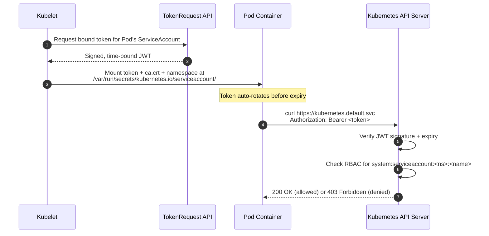

# How Kubernetes ServiceAccounts Authenticate to the API Server

This lab is a walkthrough of how a Kubernetes **ServiceAccount** lets a process running inside a Pod talk to the Kubernetes API server. this lab focuses on the **mechanics of the token itself** — where it lives, what's inside it, how it's used to call the API directly with `curl`, and how it differs from the `default` ServiceAccount.

---

## What we Will Learn

- Every Pod is automatically assigned a ServiceAccount identity (even if you don't specify one).
- The Kubelet mounts a short-lived, auto-rotating JWT token, a CA certificate, and a namespace file into every Pod.
- You can decode and inspect that token to see exactly what claims it carries.
- You can use that token to call the Kubernetes API server directly with `curl` — no `kubectl` required.
- Creating a dedicated ServiceAccount per workload (instead of using `default`) is a security best practice.

---

## Architecture



---

## Prerequisites

- A working EKS/Kubernetes cluster and `kubectl` configured against it (see [01-eksctl-lab.md](01-eksctl-lab.md) or [02-terraform-lab.md](02-terraform-lab.md)).
- `jq` and `base64` available on your local machine (used to decode the JWT).

---

## Overview

```
Step 1 → Inspect the default ServiceAccount every Pod gets for free
Step 2 → Deploy a Pod and locate the mounted token files
Step 3 → Decode the JWT token and inspect its claims
Step 4 → Call the API server directly with curl using the token
Step 5 → Create a dedicated ServiceAccount and compare identities
Step 6 → Grant minimal RBAC and re-run the curl call successfully
Step 7 → Clean up
```

---

## Step 1 — Inspect the Default ServiceAccount

Every namespace automatically gets a ServiceAccount named `default`. Any Pod that doesn't explicitly set `serviceAccountName` uses it.

```bash
kubectl create namespace sa-lab
kubectl get serviceaccount -n sa-lab
kubectl describe serviceaccount default -n sa-lab
```

> **Key Learning**: You get a ServiceAccount identity whether you ask for one or not. This is why explicitly assigning a purpose-built ServiceAccount to every workload matters — otherwise everything shares the same broad `default` identity.

---

## Step 2 — Deploy a Pod and Locate the Mounted Token

Create `sa-lab-pod.yaml`:

```yaml
apiVersion: v1
kind: Pod
metadata:
  name: sa-lab-pod
  namespace: sa-lab
spec:
  containers:
  - name: tools
    image: curlimages/curl:latest
    command: ["sleep", "3600"]
```

Apply it and wait for it to run:

```bash
kubectl apply -f sa-lab-pod.yaml
kubectl wait --for=condition=Ready pod/sa-lab-pod -n sa-lab --timeout=60s
```

Exec in and look at the mounted projected volume:

```bash
kubectl exec -it sa-lab-pod -n sa-lab -- sh -c "ls -l /var/run/secrets/kubernetes.io/serviceaccount/"
```

You should see three files:

| File | Purpose |
|------|---------|
| `token` | Signed, short-lived JWT identifying `system:serviceaccount:sa-lab:default` |
| `ca.crt` | Cluster CA certificate, used to trust the API server's TLS cert |
| `namespace` | The namespace the Pod is running in, read by client libraries |

```bash
kubectl exec -it sa-lab-pod -n sa-lab -- sh -c "cat /var/run/secrets/kubernetes.io/serviceaccount/namespace"
```

> **Key Learning**: This is a **projected volume**, mounted in-memory (not a Secret object since Kubernetes 1.24+). The token is bound to the Pod and auto-rotates roughly every hour.

---

## Step 3 — Decode the JWT and Inspect Its Claims

JWTs are three base64url-encoded segments separated by `.`: `header.payload.signature`. From your **local machine**:

```bash
TOKEN=$(kubectl exec sa-lab-pod -n sa-lab -- cat /var/run/secrets/kubernetes.io/serviceaccount/token)
echo "$TOKEN" | cut -d '.' -f2 | base64 -d 2>/dev/null | jq .
```

Expected output (abridged):

```json
{
  "aud": ["https://kubernetes.default.svc"],
  "exp": 1234567890,
  "iss": "https://oidc.eks.<region>.amazonaws.com/id/<cluster-id>",
  "kubernetes.io": {
    "namespace": "sa-lab",
    "pod": { "name": "sa-lab-pod", "uid": "..." },
    "serviceaccount": { "name": "default", "uid": "..." }
  },
  "sub": "system:serviceaccount:sa-lab:default"
}
```

> **Key Learning**: The `sub` claim (`system:serviceaccount:sa-lab:default`) is exactly the identity the API server's RBAC layer authorizes against. The token is scoped (`aud`) to the API server, has an expiry (`exp`), and is cryptographically bound to the specific Pod's UID — a stolen token can't be replayed against a different Pod once that Pod is deleted.

---

## Step 4 — Call the API Server Directly with `curl`

No `kubectl` required — the same in-cluster environment variables and mounted files are all a client needs.

```bash
kubectl exec -it sa-lab-pod -n sa-lab -- sh -c '
  TOKEN=$(cat /var/run/secrets/kubernetes.io/serviceaccount/token)
  curl -s --cacert /var/run/secrets/kubernetes.io/serviceaccount/ca.crt \
    -H "Authorization: Bearer $TOKEN" \
    https://kubernetes.default.svc/api/v1/namespaces/sa-lab/pods
'
```

Expected result: **`403 Forbidden`**, because the `default` ServiceAccount has no RBAC permissions.

```json
{
  "kind": "Status",
  "status": "Failure",
  "message": "pods is forbidden: User \"system:serviceaccount:sa-lab:default\" cannot list resource \"pods\" in API group \"\" in the namespace \"sa-lab\"",
  "reason": "Forbidden",
  "code": 403
}
```

> **Key Learning**: `https://kubernetes.default.svc` is a ClusterIP Service that always resolves to the API server from inside the cluster — `KUBERNETES_SERVICE_HOST`/`PORT` env vars (injected into every Pod) point to the same thing. Authentication succeeded (the server understood *who* you are); authorization failed (RBAC says *no*).

---

## Step 5 — Create a Dedicated ServiceAccount and Compare

Using `default` for everything is an anti-pattern. Create a purpose-built ServiceAccount instead.

`sa-lab-sa.yaml`:

```yaml
apiVersion: v1
kind: ServiceAccount
metadata:
  name: pod-reader-sa
  namespace: sa-lab
```

Update the Pod to use it — `sa-lab-pod-v2.yaml`:

```yaml
apiVersion: v1
kind: Pod
metadata:
  name: sa-lab-pod-v2
  namespace: sa-lab
spec:
  serviceAccountName: pod-reader-sa
  containers:
  - name: tools
    image: curlimages/curl:latest
    command: ["sleep", "3600"]
```

```bash
kubectl apply -f sa-lab-sa.yaml
kubectl apply -f sa-lab-pod-v2.yaml
kubectl wait --for=condition=Ready pod/sa-lab-pod-v2 -n sa-lab --timeout=60s
```

Re-check the token's `sub` claim to confirm the identity changed:

```bash
TOKEN2=$(kubectl exec sa-lab-pod-v2 -n sa-lab -- cat /var/run/secrets/kubernetes.io/serviceaccount/token)
echo "$TOKEN2" | cut -d '.' -f2 | base64 -d 2>/dev/null | jq -r .sub
```

Expected: `system:serviceaccount:sa-lab:pod-reader-sa`

---

## Step 6 — Grant Minimal RBAC and Validate Success

`sa-lab-rbac.yaml`:

```yaml
apiVersion: rbac.authorization.k8s.io/v1
kind: Role
metadata:
  name: pod-reader-role
  namespace: sa-lab
rules:
- apiGroups: [""]
  resources: ["pods"]
  verbs: ["get", "list"]
---
apiVersion: rbac.authorization.k8s.io/v1
kind: RoleBinding
metadata:
  name: pod-reader-binding
  namespace: sa-lab
subjects:
- kind: ServiceAccount
  name: pod-reader-sa
  namespace: sa-lab
roleRef:
  kind: Role
  name: pod-reader-role
  apiGroup: rbac.authorization.k8s.io
```

```bash
kubectl apply -f sa-lab-rbac.yaml
```

Re-run the same `curl` call against the new Pod (no restart needed — RBAC changes apply immediately):

```bash
kubectl exec -it sa-lab-pod-v2 -n sa-lab -- sh -c '
  TOKEN=$(cat /var/run/secrets/kubernetes.io/serviceaccount/token)
  curl -s --cacert /var/run/secrets/kubernetes.io/serviceaccount/ca.crt \
    -H "Authorization: Bearer $TOKEN" \
    https://kubernetes.default.svc/api/v1/namespaces/sa-lab/pods | jq ".items[].metadata.name"
'
```

Expected result: `200 OK`, listing `sa-lab-pod-v2` (and `sa-lab-pod` if still running).

### Validation Checklist

- [ ] `default` ServiceAccount call returned `403 Forbidden` (Step 4)
- [ ] Decoded JWT `sub` claim matched the ServiceAccount bound to each Pod (Steps 3 & 5)
- [ ] `pod-reader-sa` call returned `200 OK` only after the Role/RoleBinding existed (Step 6)
- [ ] No `kubectl` binary was used inside the Pod — only `curl` and mounted files

---

## Step 7 — Clean Up

```bash
kubectl delete namespace sa-lab
```

---

## Real-World Example — An App Inside a Pod Fetching Live Data from the API Server

The steps above proved the mechanics with raw `curl`. Now let's see how a **real application process** does this — using the official Kubernetes Python client, the same way a monitoring agent, custom controller, or autoscaler would. The app will run inside a Pod, call the API server using its mounted ServiceAccount, fetch live Pod data from its namespace, and process it (count Pods by phase).

### 8a. Create the namespace, ServiceAccount, and RBAC

```bash
kubectl create namespace sa-app-demo
```

`app-sa.yaml`:

```yaml
apiVersion: v1
kind: ServiceAccount
metadata:
  name: pod-watcher-sa
  namespace: sa-app-demo
---
apiVersion: rbac.authorization.k8s.io/v1
kind: Role
metadata:
  name: pod-watcher-role
  namespace: sa-app-demo
rules:
- apiGroups: [""]
  resources: ["pods"]
  verbs: ["get", "list", "watch"]
---
apiVersion: rbac.authorization.k8s.io/v1
kind: RoleBinding
metadata:
  name: pod-watcher-binding
  namespace: sa-app-demo
subjects:
- kind: ServiceAccount
  name: pod-watcher-sa
  namespace: sa-app-demo
roleRef:
  kind: Role
  name: pod-watcher-role
  apiGroup: rbac.authorization.k8s.io
```

```bash
kubectl apply -f app-sa.yaml
```

### 8b. Application code

This small Python script uses `config.load_incluster_config()` — which internally reads the exact same token, CA cert, and namespace files from Step 2 — to authenticate to the API server, list Pods, and process the result (count by phase).

`app.py` (packaged into a ConfigMap so we don't need to build an image):

```python
from kubernetes import client, config
import time

def main():
    # Reads /var/run/secrets/kubernetes.io/serviceaccount/{token,ca.crt,namespace}
    config.load_incluster_config()
    v1 = client.CoreV1Api()

    my_namespace = open(
        "/var/run/secrets/kubernetes.io/serviceaccount/namespace"
    ).read().strip()

    while True:
        pods = v1.list_namespaced_pod(namespace=my_namespace)

        # "processing" the data fetched from the API server
        phase_counts = {}
        for pod in pods.items:
            phase_counts[pod.status.phase] = phase_counts.get(pod.status.phase, 0) + 1

        print(f"[{my_namespace}] Pod count by phase: {phase_counts}", flush=True)
        time.sleep(10)

if __name__ == "__main__":
    main()
```

```bash
kubectl create configmap pod-watcher-code -n sa-app-demo --from-file=app.py
```

### 8c. Deploy the app Pod bound to the ServiceAccount

`app-pod.yaml`:

```yaml
apiVersion: v1
kind: Pod
metadata:
  name: pod-watcher-app
  namespace: sa-app-demo
spec:
  serviceAccountName: pod-watcher-sa
  containers:
  - name: watcher
    image: python:3.12-slim
    command: ["sh", "-c", "pip install --quiet kubernetes && python /app/app.py"]
    volumeMounts:
    - name: code
      mountPath: /app
  volumes:
  - name: code
    configMap:
      name: pod-watcher-code
```

```bash
kubectl apply -f app-pod.yaml
kubectl wait --for=condition=Ready pod/pod-watcher-app -n sa-app-demo --timeout=120s
```

### 8d. Validate — watch the app fetch and process live data

```bash
kubectl logs -f pod/pod-watcher-app -n sa-app-demo
```

Expected output, refreshing every 10 seconds:

```
[sa-app-demo] Pod count by phase: {'Running': 1}
[sa-app-demo] Pod count by phase: {'Running': 1}
```

Now generate a real change and confirm the app "sees" it live through the API server — no restart of the app required:

```bash
kubectl run extra-pod --image=nginx -n sa-app-demo
```

Within ~10 seconds, the log output updates to reflect the new Pod:

```
[sa-app-demo] Pod count by phase: {'Running': 2}
```

> **Key Learning**: This is exactly what real controllers, operators, and monitoring tools do in production — they never store static credentials. They call `config.load_incluster_config()` (or the Go/Java/Node equivalent), which transparently uses the ServiceAccount token mounted in Step 2, and every API call is authorized against the RBAC rules bound to `pod-watcher-sa`. Try deleting the `RoleBinding` while the app is running to see the log output change to a `403 Forbidden` error on the very next poll — proving authorization is re-evaluated on every request, not just at startup.

### 8e. Clean up this example

```bash
kubectl delete namespace sa-app-demo
```

---

## Key Takeaways

1. **Every Pod has an identity** — explicitly assign one instead of relying on `default`.
2. **Authentication ≠ Authorization** — a valid token only proves *who* you are; RBAC decides *what* you can do.
3. **Tokens are short-lived, audience-scoped, and Pod-bound** — a major security improvement over the old long-lived Secret-based tokens.
4. Communicating with the API server from inside a Pod requires only three things: the **token**, the **CA cert**, and the **API server's in-cluster DNS name** (`kubernetes.default.svc`) — this is exactly what client libraries (like `client-go`, IRSA, or service meshes) do under the hood.
