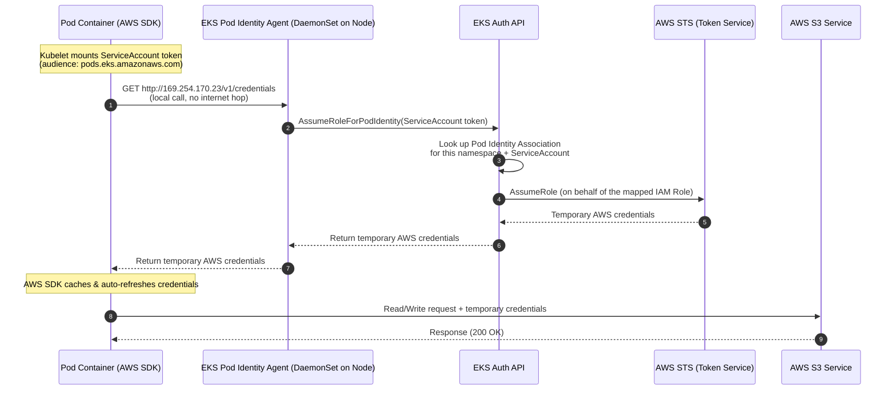

# Architectural Guide: Understanding Amazon EKS Pod Identity

This document explains how **Amazon EKS Pod Identity** works — the newer, simpler mechanism for giving Pods AWS permissions, and how it differs from OIDC-based IRSA (see [eks-oidc-provider-explanation.md](eks-oidc-provider-explanation.md)).

---

## Simple Explanation (No Prior AWS/Kubernetes Knowledge Needed)

Think of it like an **office building with a badge office on-site**:

- **The office building (your EKS cluster)** has its own **badge office in the lobby (the EKS Pod Identity Agent)** — a dedicated desk that issues temporary access badges right there on the spot.
- **Head office security (AWS IAM)** pre-approves a list: "Anyone the lobby badge office vouches for, under these specific rules, can be trusted." This is a one-time, generic agreement — it doesn't need to know anything about *your specific building*.
- **A separate registry (the Pod Identity Association)** kept by building management says exactly: "Employees on the 3rd floor, team 'S3-Readers' (a Kubernetes ServiceAccount), get badge type X (an IAM Role)."
- **An employee (a Pod)** walks up to the lobby badge office, shows their employee ID (the ServiceAccount's Kubernetes token), and the badge office — after checking the registry — hands them a **temporary badge (temporary AWS credentials)** that opens only the doors their team is allowed into.
- Critically, the employee doesn't have to leave the building or call an outside travel agency (an OIDC identity provider) to get this badge — everything happens **locally, in the lobby**, which is faster and simpler to set up.

| Analogy | Real Concept |
|---|---|
| Head office security | AWS IAM |
| Lobby badge office | EKS Pod Identity Agent (a DaemonSet running on every node) |
| Registry mapping team → badge type | Pod Identity Association (`aws eks create-pod-identity-association`) |
| Employee | Pod |
| Employee ID | Kubernetes ServiceAccount token (audience: `pods.eks.amazonaws.com`) |
| Temporary badge | Temporary AWS credentials from STS |
| No outside travel agency needed | No OIDC provider / trust-policy-per-cluster required |

**Why is this simpler than IRSA?** With IRSA, the "travel agency" (OIDC provider) has to be registered with head office *per cluster*, and every IAM Role's trust policy has to mention that specific agency and the exact team name. With Pod Identity, the badge office trust is **generic** — one IAM Role can be reused across many clusters without editing its trust policy, because the specific "who gets what" mapping lives in the separate registry (the Association), not in the IAM Role itself.

---

## How It Actually Works

1. Every EKS node runs the **`eks-pod-identity-agent`** as a DaemonSet — this is the "lobby badge office," always available locally on the node.
2. The Kubelet mounts a Kubernetes ServiceAccount token into the Pod, scoped for the audience `pods.eks.amazonaws.com` (not for AWS STS directly, like IRSA does).
3. AWS keeps a separate mapping object called a **Pod Identity Association**, which says: "ServiceAccount `X` in namespace `Y` of cluster `Z` maps to IAM Role `R`."
4. When the AWS SDK inside the Pod needs credentials, it doesn't call AWS STS over the internet — it calls a **local link-local address** (`169.254.170.23`) served by the Pod Identity Agent on the same node.
5. The Agent takes the Pod's ServiceAccount token, calls the **EKS Auth API** (`AssumeRoleForPodIdentity`), which looks up the Association, then calls STS on the Pod's behalf, and hands back temporary credentials to the Pod.

---

## Token Exchange Architecture (Mermaid)



---

## Anatomy of the Trust Policy and the Association

Unlike IRSA, the IAM Role's trust policy is **generic** — it doesn't reference your cluster at all:

```json
{
  "Version": "2012-10-17",
  "Statement": [
    {
      "Effect": "Allow",
      "Principal": {
        "Service": "pods.eks.amazonaws.com"
      },
      "Action": [
        "sts:AssumeRole",
        "sts:TagSession"
      ]
    }
  ]
}
```

The cluster-specific mapping lives entirely in the **Pod Identity Association**, created separately via the AWS CLI/API — not inside the IAM Role, and not as a Kubernetes annotation:

```bash
aws eks create-pod-identity-association \
  --cluster-name student1 \
  --namespace irsa-demo \
  --service-account s3-reader-sa \
  --role-arn arn:aws:iam::111122223333:role/EKSPodIdentityS3AccessRole
```

### Key Security Safeguards:

1.  **`Principal.Service: pods.eks.amazonaws.com`**: Only the EKS Pod Identity service itself can assume this role — not arbitrary users, not other AWS services.
2.  **The Association is the real access-control point**: Even though the trust policy is generic, a Pod can only get credentials if an explicit Association exists mapping its exact `namespace` + `ServiceAccount` to that Role. No Association means no credentials, regardless of the trust policy.
3.  **`sts:TagSession`**: Allows the EKS Auth API to tag the assumed session (e.g., with cluster/namespace/ServiceAccount info), which shows up in AWS CloudTrail for auditing exactly which Pod identity made a given API call.
4.  **Credentials never leave the node**: The Pod talks only to the local Agent over a link-local address — credentials are never transmitted over the public internet.

---

## Why EKS Pod Identity Simplifies Production Operations

*   **No OIDC provider setup per cluster**: You skip creating and associating an IAM OIDC identity provider for every cluster — one less moving part to configure and audit.
*   **Reusable IAM Roles across clusters**: The same IAM Role's trust policy works unchanged no matter which cluster assumes it; only the Association (a simple API call) changes.
*   **Faster credential delivery**: Credentials come from a local DaemonSet on the same node instead of a round trip to AWS STS via web identity federation, reducing latency and dependency on external token exchange.
*   **Clear separation of concerns**: The IAM Role answers "what can this identity do," while the Association answers "which ServiceAccount is this identity" — auditable independently as a first-class AWS API object.
*   **Zero hardcoded secrets**: Same as IRSA — credentials are ephemeral, automatically rotated, and never stored on disk or in Kubernetes Secrets.

For the hands-on lab walking through this end-to-end (including a side-by-side IRSA vs. Pod Identity comparison table), see [04-eks-pod-identity-lab.md](04-eks-pod-identity-lab.md).
