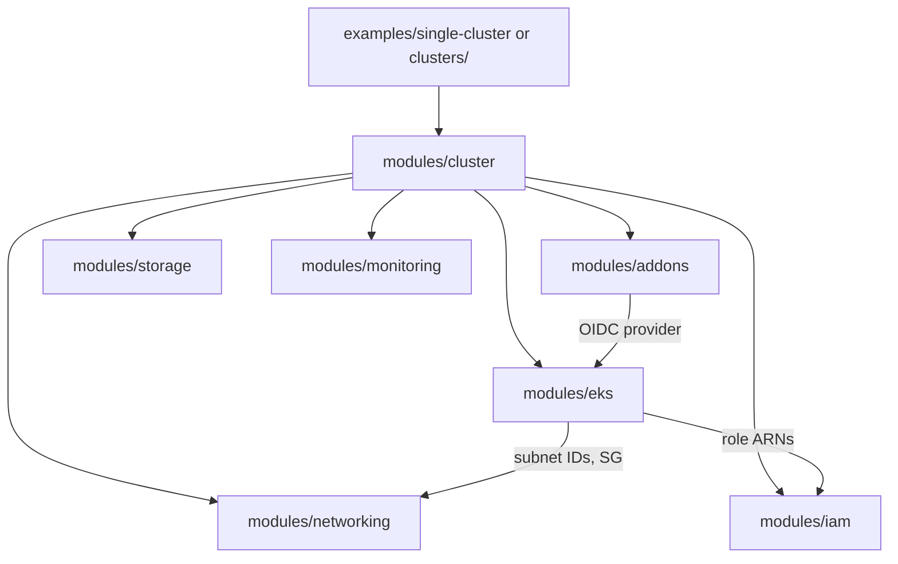

# Session Guide 1 — Terraform, Flow & Modules Walkthrough
---

## 1. What is Terraform (60-second recap)

- Terraform is **Infrastructure as Code**: you describe the desired AWS
  resources in `.tf` files, and Terraform figures out the create/update/
  delete API calls needed to make reality match that description.
- Core commands:
  - `terraform init` — downloads provider plugins (AWS, Kubernetes, Helm,
    TLS) and sets up the backend (where state is stored).
  - `terraform plan` — shows what *would* change, without changing anything.
  - `terraform apply` — actually creates/updates resources.
  - `terraform destroy` — deletes everything Terraform created.
- **State** (`terraform.tfstate`) is Terraform's record of what it created
  and the real-world IDs of those resources. Without state, Terraform
  wouldn't know what already exists.

---

## 2. Repository layout

Walk through this tree on screen:

```
terraform/
├── modules/
│   ├── networking/     # VPC, subnets, IGW, optional NAT, route tables, SGs
│   ├── iam/             # Cluster role, node role, instance profile
│   ├── eks/              # EKS control plane, node groups, OIDC, access entries
│   ├── addons/            # VPC CNI, CoreDNS, kube-proxy, EBS CSI, metrics-server, ALB (optional)
│   ├── storage/            # Default gp3 StorageClass
│   ├── monitoring/          # Optional CloudWatch log group
│   └── cluster/              # Composes ALL of the above into one EKS environment
├── clusters/                  # Root module used for MULTIPLE clusters (workspaces) — trainer-only
├── examples/single-cluster/    # Root module used for ONE cluster — what students run
├── automation/                  # Helper scripts (create-one.sh, destroy-one.sh, create-all.sh, ...)
├── scripts/                      # cost-summary.sh
└── docs/                          # These guides
```

**Key idea to emphasize:** students never edit anything under `modules/`.
They only ever touch `examples/single-cluster/main.tf` (a handful of
variables) and run `terraform apply`.

---

## 3. The module composition — what calls what



Explain each module in one sentence as you go:

| Module | Creates |
|---|---|
| `networking` | VPC, public (+ optional private) subnets, IGW, optional NAT, cluster security group |
| `iam` | IAM role for the EKS control plane; IAM role + instance profile for worker nodes |
| `eks` | The EKS control plane itself, the OIDC identity provider, an access entry granting cluster-admin, and the managed node group |
| `addons` | EKS-managed add-ons (`vpc-cni`, `coredns`, `kube-proxy`) plus optional EBS CSI driver, metrics-server, and AWS Load Balancer Controller (via Helm) |
| `storage` | A default `gp3` `StorageClass` so `PersistentVolumeClaim`s work immediately |
| `monitoring` | Optional CloudWatch log group for control-plane logs |

---

## 4. Required variables — what a student must decide

Show `examples/single-cluster/main.tf`:

```hcl
module "cluster" {
  source = "../../01-modules/cluster"

  cluster_name = "dev01"       # <-- REQUIRED, must be unique per student
  environment  = "dev"
  owner        = "platform-team"

  instance_type = "t3.medium"
  node_count    = 3
}
```

- `cluster_name` is the **only required** variable — it's used to prefix
  every AWS resource name and tag, so it must be unique per student (e.g.
  their name or student ID: `alice01`, `student07`).
- Everything else has a sensible default (region `us-east-2`, Kubernetes
  `1.31`, `t3.medium` x 3 nodes, EBS CSI + metrics-server on, NAT/ALB off to
  save cost).

---

## 5. What happens end-to-end during `terraform apply`

Talk through the order of operations (matches the `depends_on` graph
Terraform builds automatically):

1. `networking` creates the VPC/subnets/security group first — everything
   else needs a place to live.
2. `iam` creates the two roles in parallel with networking (no dependency).
3. `eks` waits for both `networking` (subnet/SG IDs) and `iam` (role ARNs),
   then creates the control plane (~10 min) and the OIDC provider, then the
   managed node group (~3-5 min for nodes to join).
4. `addons` waits for `eks` (needs the OIDC provider ARN for IRSA roles),
   then installs the core add-ons and any optional Helm charts.
5. `storage` and `monitoring` run once the cluster exists.

Total: **~15–20 minutes**, most of it waiting on AWS to provision the EKS
control plane and EC2 nodes to boot.

---

## 6. State & isolation — why students can't break each other

- Each student's `examples/single-cluster` directory (once cloned into
  their own jump box / home directory) has its **own local state file**.
  There is no shared state between students.
- Every resource is tagged `Cluster = <cluster_name>`, so even in a shared
  AWS account, resources are trivially identifiable and independently
  destroyable.
- Trainers who need many clusters from **one** machine use the
  `clusters/` root module with Terraform **workspaces** instead (see
  Guide 5) — students don't need to know about this.

---

## 7. What's next

Hand off to **Guide 2** (Clone & Apply) for students to run this
themselves on their jump box.
