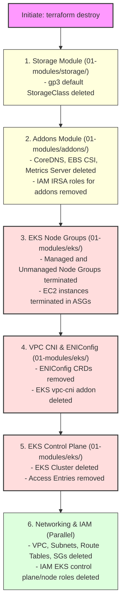

# Terraform Destroy Flow & Dependency Cleanup

This document explains the resource destruction sequence when `terraform destroy` is executed. In Terraform, destruction is not random; it is the **exact mathematical reverse** of the provisioning dependency graph (Directed Acyclic Graph or DAG).

---

## ⚠️ CRITICAL WARNING: Pre-Destroy Ingress Cleanup

Before executing `terraform destroy`, you **must** delete any Kubernetes Ingress resources (e.g. Nginx Ingress or AWS ALBs) manually using `kubectl delete`.

```
                  Kubernetes Ingress (ALB) Active
                               │
                               ▼
            Terraform deletes EKS Node Groups & Controller
                               │
                               ▼
        ALB remains orphaned in AWS (no controller to clean it up)
                               │
                               ▼
      Terraform VPC/Subnet deletion fails with DependencyViolation ❌
```

**Why this happens**: The AWS Load Balancer Controller provisions ALBs and Target Groups directly in your AWS account in response to Ingress objects. If the cluster is destroyed first, the controller is terminated, leaving orphaned load balancers attached to your subnets. AWS will then block the deletion of subnets/VPCs because they are "in use".

---

## Architectural Destroy Flow (Mermaid)

The following diagram illustrates the order in which modules and core resources are destroyed (from top/last-created to bottom/first-created):



---

## Step-by-Step Destruction Sequence

### Step 1: Storage Class (`01-modules/storage`)
Because the storage module explicitly depends on the `addons` module, it is evaluated and destroyed first. The default `gp3` Kubernetes StorageClass is deleted.

---

### Step 2: Addons Module (`01-modules/addons`)
The higher-level EKS addons and integrations are destroyed:
*   **Kubernetes objects**: CoreDNS and EBS CSI driver addons are deleted.
*   **Helm releases**: AWS Load Balancer Controller is uninstalled (if enabled).
*   **IAM permissions**: The IAM Role for Service Accounts (IRSA) configurations (such as the EBS CSI role and ALB controller role) are deleted.

---

### Step 3: EKS Node Groups (`01-modules/eks`)
The worker nodes must be completely terminated before the EKS Control Plane can be shut down:
*   **Managed Node Group**: EKS terminates the EC2 instances in the managed node group.
*   **Unmanaged Node Group**: The Auto Scaling Group (ASG) scales down to `0`, terminating self-managed EC2 instances, and the launch template is deleted.

---

### Step 4: VPC CNI & ENIConfig Manifests (`01-modules/eks`)
*   The `terraform_data.apply_eniconfig` resource triggers deletion (which doesn't require explicit actions since the cluster is going away, but resource definitions are cleared).
*   The `vpc-cni` EKS addon is deleted from the cluster control plane.

---

### Step 5: EKS Control Plane & Access Entries (`01-modules/eks`)
*   The EKS cluster Access Entries (caller identities, additional admins) are deleted.
*   The EKS Control Plane (`aws_eks_cluster.this`) itself is deleted (takes ~10–12 minutes).

---

### Step 6: Networking & IAM Modules (Parallel)
Once all EKS cluster resources are gone, EKS has detached its elastic network interfaces (ENIs) from the subnets. Terraform can now safely clean up the base infrastructure:
*   **IAM Module**: Deletes the EKS Cluster and Node IAM Roles.
*   **Networking Module**: Deletes Subnets, Route Tables, Security Groups, Internet Gateway, and finally the VPC itself.
